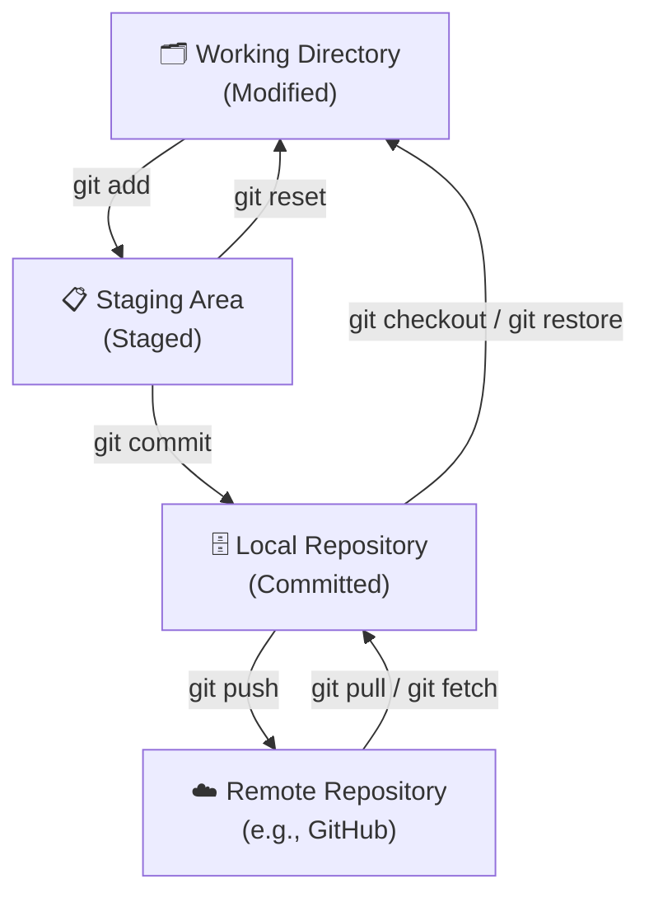

<div align="center">

<h1>Module 00 — Introduction</h1>
<h3>Why Git? Version Control, Setup & Configuration</h3>

[](../README.md)
[](#)
[](#3-the-cheat-code-section)
[](#4-hands-on-lab)
[](../LICENSE)

**[← Course Home](../README.md) · [Next: Foundations →](../01-Foundations/README.md) · [📋 Full Cheat Sheet](../CHEATSHEET.md)**

</div>

---

## 📋 Module Contents

- [Learning Objectives](#-learning-objectives)
- [1. Theoretical Explanation](#1-theoretical-explanation)
  - [What Is a VCS?](#what-is-a-version-control-system)
  - [Distributed vs. Centralized VCS](#distributed-vs-centralized-vcs)
  - [A Brief History of Git](#a-brief-history-of-git)
  - [Git vs GitHub — What Is the Difference?](#git-vs-github--what-is-the-difference)
  - [What Is a Repository?](#what-is-a-repository)
  - [Git's Three States](#gits-three-states)
  - [Installing Git](#installing-git)
- [2. Visual Diagram](#2-visual-diagram)
- [3. The "Cheat Code" Section](#3-the-cheat-code-section)
- [4. Hands-on Lab](#4-hands-on-lab)
- [5. Practice Exercises](#5-️-practice-exercises)
  - [Exercise 1 — Verify Your Installation](#exercise-1--verify-your-installation)
  - [Exercise 2 — Set Identity and Verify It Stuck](#exercise-2--set-identity-and-verify-it-stuck)
  - [Exercise 3 — Create Three Useful Aliases](#exercise-3--create-three-useful-aliases)
  - [Exercise 4 — Read Your .gitconfig Directly](#exercise-4--read-your-gitconfig-directly)
  - [Exercise 5 — Set Your Default Editor](#exercise-5--set-your-default-editor)
  - [Self-Assessment](#-module-00-self-assessment)

---

## 🎯 Learning Objectives

By the end of this module you will be able to:

1. Understand what version control is and why Git exists.
2. Install Git on Windows, macOS, and Linux.
3. Configure global identity settings.

---

## 1. Theoretical Explanation

> **Estimated read time:** 10 minutes · **Lab time:** 10 minutes

### What Is a Version Control System?

A **Version Control System (VCS)** is software that tracks changes to files over time. It allows you to:

- Recall specific versions of files at any point in history.
- See who changed what and when.
- Collaborate with others without overwriting each other's work.
- Experiment freely — because you can always roll back.

### Distributed vs. Centralized VCS

There are two primary architectures for version control systems:

| Type | Examples | How It Works |
|---|---|---|
| **Centralized VCS** | Apache SubVersion (SVN), Piper (used by Google) | Single central server holds all history; developers check out working copies |
| **Distributed VCS** | **Git**, Mercurial | Every developer has a complete local copy of the full repository history |

**Git** is a **distributed** VCS. You have the full history on your machine — no network required to commit, branch, or inspect logs. The server is just another peer.

> [!NOTE]
> The course outline references three VCS systems: **Git** (distributed, open-source), **Apache SubVersion** (centralized, open-source), and **Piper** (Google's internal centralized VCS, used for the monorepo that holds billions of lines of code). Understanding these differences helps you appreciate why Git's design choices matter at scale.

### A Brief History of Git

In 2002, the Linux kernel project used a proprietary distributed VCS called **BitKeeper**. In 2005, a dispute between the Linux community and BitKeeper's developer ended that arrangement. **Linus Torvalds** — creator of Linux — spent just ten days writing the first version of Git himself.

Git was designed with these goals:

- Speed
- Simple design
- Strong support for non-linear development (thousands of parallel branches)
- Fully distributed
- Able to handle large projects like the Linux kernel efficiently

### Git vs GitHub — What Is the Difference?

This confuses almost every beginner. They sound the same but they are completely different things.

**Git** is a tool. It runs on your computer. It tracks changes to files. It has nothing to do with the internet. You can use Git with zero internet connection, on a machine that has never been online. Git is free, open-source software you install locally.

**GitHub** is a website. It is a hosting service that stores copies of your Git repositories online. It adds features on top of Git — Pull Requests, Issues, Actions, Pages, team management. GitHub is owned by Microsoft. There are alternatives: GitLab, Bitbucket, Gitea.

Think of it this way:
- **Git** = Microsoft Word (the software on your computer)
- **GitHub** = Google Drive (a website that stores and shares your Word documents)

You write documents in Word. You upload them to Google Drive so others can see them. You could use Word without Google Drive. You could use Google Drive with other editors.

Same with Git and GitHub:
- You make commits with **Git** (locally, on your computer)
- You upload those commits to **GitHub** (so others can see them, or so you have a backup)

| | Git | GitHub |
|---|---|---|
| What it is | Software (CLI tool) | Website / cloud service |
| Who made it | Linus Torvalds | GitHub Inc. (now Microsoft) |
| Where it runs | Your local computer | github.com servers |
| Needs internet? | No | Yes |
| Cost | Free forever | Free for public repos; paid for some private features |
| Alternatives | Mercurial, SVN | GitLab, Bitbucket, Gitea |

---

### What Is a Repository?

A **repository** (or "repo") is just a folder that Git is tracking.

That's it. It's a normal folder on your computer, but with a hidden `.git/` subfolder inside it. That `.git/` folder is where Git stores all the history, branches, and configuration.

```
my-project/          ← This is your repository (the whole folder)
├── .git/            ← This is where Git stores ALL the history
├── README.md        ← Your normal files
├── index.html       ← Your normal files
└── style.css        ← Your normal files
```

When someone says "clone the repo", they mean: download this folder (and its entire `.git/` history) to your computer.

When someone says "push to the repo", they mean: upload your new commits from your local `.git/` to the server's `.git/`.

There are two kinds of repositories:
- **Local repository** — lives on your computer (the `my-project/` folder above)
- **Remote repository** — lives on a server like GitHub (accessible via a URL)

They are copies of each other. You sync them with `git push` and `git pull`.

---

### Git's Three States

Every file in a Git repository lives in one of three states. Understanding this is the single most important mental model in Git.

```
Modified → Staged → Committed
```

| State | Location | Meaning |
|---|---|---|
| **Modified** | Working Directory | You have changed the file but not yet told Git about it |
| **Staged** | Staging Area (Index) | You have marked the change to go into the next commit snapshot |
| **Committed** | Local Repository | The snapshot is safely stored in your local Git database |

> [!NOTE]
> Git tracks **changes**, not files. This is the fundamental mental model shift new users need.

### Installing Git

**Windows:**
```bash
# Option 1: Download the installer from https://git-scm.com/download/win
# Option 2: Use winget
winget install --id Git.Git -e --source winget
```

**macOS:**
```bash
# Option 1: Xcode Command Line Tools (installs Git automatically)
xcode-select --install

# Option 2: Homebrew
brew install git
```

**Linux (Debian/Ubuntu):**
```bash
sudo apt update && sudo apt install git
```

**Linux (Fedora/RHEL):**
```bash
sudo dnf install git
```

Verify installation:
```bash
git --version
# Expected output: git version 2.x.x
```

---

## 2. Visual Diagram

Git's three states and the commands that move files between them:



---

## 3. The "Cheat Code" Section

| Command | Description |
|---|---|
| `git config --global user.name "[firstname lastname]"` | Set name used in all version history credit |
| `git config --global user.email "[valid-email]"` | Set email associated with all history markers |
| `git config --global color.ui auto` | Enable automatic colorized output in the terminal |
| `git config --global core.excludesfile [file]` | Set a system-wide ignore pattern file |
| `git config alias.st status` | Add an alias — `git st` becomes shorthand for `git status` |
| `git config --global ...` | Apply any config option globally across all repositories |
| `man git-config` | See all possible configuration options in the manual |
| `git --version` | Verify Git is installed and check the version |

---

## 4. Hands-on Lab

### Lab: "Your First Git Identity Setup"

Great job making it to the first lab! Let's get your Git identity configured.

**Prerequisites:** Git installed (see installation steps above).

**Steps:**

**Step 1 — Verify Git is installed:**
```bash
git --version
```
You should see something like `git version 2.43.0`. If you get a "command not found" error, revisit the installation steps above.

**Step 2 — Set your name:**
```bash
git config --global user.name "Your Name"
```
Replace `"Your Name"` with your actual name (or the name you want to appear in commit history).

**Step 3 — Set your email:**
```bash
git config --global user.email "you@example.com"
```
Use the same email you plan to use for your GitHub account.

**Step 4 — Enable color output:**
```bash
git config --global color.ui auto
```

**Step 5 — Verify your configuration:**
```bash
cat ~/.gitconfig
```
You should see output like:
```ini
[user]
    name = Your Name
    email = you@example.com
[color]
    ui = auto
```

**Step 6 — Add a `st` alias for `status`:**
```bash
git config --global alias.st status
```

**Step 7 — Test the alias:**
```bash
git st
```
You will see: `fatal: not a git repository`. **This is correct at this stage!** You haven't created a repository yet — that's the next module.

> [!TIP]
> Your global config is stored in `~/.gitconfig`. You can edit it directly with any text editor. For example: `code ~/.gitconfig` (VS Code) or `nano ~/.gitconfig`.

**Checkpoint:** You should now have a `~/.gitconfig` file with your name, email, color setting, and `st` alias. You're ready to move to Module 01!

---

---

## 5. 🏋️ Practice Exercises

> Complete these before moving to Module 01. Each one takes under 5 minutes and builds real muscle memory. Check off each task as you finish it.

---

### Exercise 1 — Verify Your Installation
**Task:** Run the version command and confirm Git is installed correctly.
```bash
git --version
```
- [ ] **Done** when you see `git version 2.x.x` (any version ≥ 2.23 is fine)

**Confidence check:** Can you explain where Git is installed on your machine?

---

### Exercise 2 — Set Identity and Verify It Stuck
**Task:** Set your name and email, then verify both were saved.
```bash
git config --global user.name "Your Name"
git config --global user.email "you@example.com"
git config --list | grep user
```
- [ ] **Done** when `git config --list` shows your name and email in the output

> [!NOTE]
> `git config --list` shows every configuration key. Look for the lines starting with `user.name` and `user.email`.

---

### Exercise 3 — Create Three Useful Aliases
**Task:** Create these three shortcuts and test each one.
```bash
git config --global alias.st status
git config --global alias.lg "log --oneline --graph --all"
git config --global alias.last "log -1 HEAD"
```
Test them (you'll see "not a git repository" errors — that's fine at this stage):
```bash
git st
git lg
git last
```
- [ ] **Done** when all three commands run without a "no such command" error

**What you built:** `git st` = status, `git lg` = visual log, `git last` = see your most recent commit at a glance. You'll use these constantly.

---

### Exercise 4 — Read Your .gitconfig Directly
**Task:** Open and read your global config file without using `git config`.
```bash
# macOS / Linux
cat ~/.gitconfig

# Windows
cat C:/Users/YOUR-WINDOWS-USERNAME/.gitconfig
```
- [ ] **Done** when you can see the `[user]`, `[color]`, and `[alias]` sections in the output

**Why this matters:** Your `.gitconfig` is just a text file. You can edit it directly in any editor. Knowing where it lives means you can always fix a misconfiguration.

---

### Exercise 5 — Set Your Default Editor
**Task:** Tell Git which editor to open when it needs you to write a message.
```bash
# VS Code
git config --global core.editor "code --wait"

# Nano (beginner-friendly terminal editor)
git config --global core.editor nano

# Vim (if you're brave)
git config --global core.editor vim
```
- [ ] **Done** when `git config --global core.editor` shows your chosen editor

> [!TIP]
> The `--wait` flag for VS Code tells Git to wait until you close the editor tab before continuing. Without it, Git won't see your message.

---

### 🎯 Module 00 Self-Assessment

Before moving on, answer these without looking at the notes:

| Question | Answer |
|---|---|
| What is the difference between Git and GitHub? | *(write your answer)* |
| What are Git's three states for a file? | *(write your answer)* |
| What does `--global` do in a git config command? | *(write your answer)* |
| Where is your global config stored? | *(write your answer)* |

If you can answer all four, you're ready for Module 01. If not, re-read the relevant section and try again — understanding is more valuable than speed.

---

<div align="center">

| ← Previous | Home | Next → |
|:---:|:---:|:---:|
| *(Start of course)* | [📖 Course Home](../README.md) | [01 — Foundations](../01-Foundations/README.md) |

**[📋 Full Cheat Sheet](../CHEATSHEET.md) · [🛠️ Practice Lab](../Practice-Lab/README.md) · [📄 License](../LICENSE)**

*Part of the free, open-source [GIT&GITHUB](../README.md) curriculum — MIT Licensed.*

</div>
