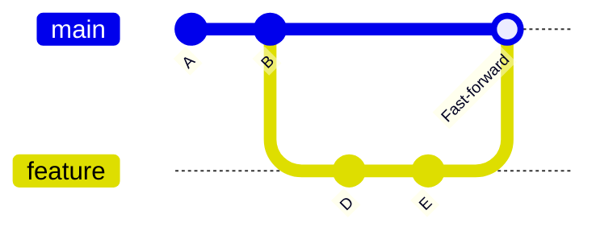
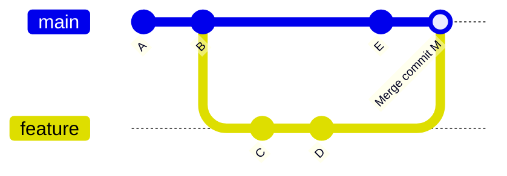
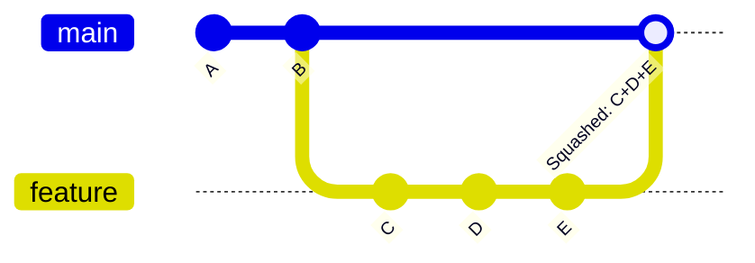

<div align="center">

<h1>Module 02 — Intermediate Workflows</h1>
<h3>Branching, Merging & Stashing</h3>

[](../README.md)
[](#)
[](#3-the-cheat-code-section)
[](#2-visual-diagrams)
[](#4-hands-on-lab)
[](../LICENSE)

**[← 01 Foundations](../01-Foundations/README.md) · [Course Home](../README.md) · [03 Remote Collaboration →](../03-Remote-Collaboration/README.md)**

</div>

---

## 📋 Module Contents

- [Learning Objectives](#-learning-objectives)
- [1. Theoretical Explanation](#1-theoretical-explanation)
  - [Branches as Lightweight Pointers](#branches-as-lightweight-pointers)
  - [HEAD: Where You Are](#head-where-you-are-right-now)
  - [git switch vs git checkout](#git-switch-modern-vs-git-checkout-legacy)
  - [Fast-Forward Merge](#fast-forward-merge)
  - [3-Way Merge](#3-way-recursive-merge)
  - [Squash Merge](#squash-merge)
  - [Stash](#stash-your-uncommitted-work-clipboard)
- [2. Visual Diagrams](#2-visual-diagrams)
- [3. The "Cheat Code" Section](#3-the-cheat-code-section)
- [4. Hands-on Lab](#4-hands-on-lab)

---

## 🎯 Learning Objectives

By the end of this module you will be able to:

1. Create and switch between branches.
2. Understand fast-forward vs. 3-way (recursive) merge.
3. Resolve merge conflicts.
4. Use stash for work-in-progress management.

---

## 1. Theoretical Explanation

### Branches as Lightweight Pointers

A **branch** in Git is nothing more than a lightweight, movable pointer to a single commit. When you create a branch, Git creates a 41-byte file containing the SHA of the commit it points to. That's it.

This is why branches in Git are so cheap to create and delete — there's no copying of files or history involved.

### HEAD: Where You Are Right Now

**HEAD** is a special pointer that tells Git "this is where you are right now."

Think of HEAD like a bookmark in a book. The book is your commit history. HEAD is the page you're currently on.

In normal use, HEAD points to your current **branch name** (not directly to a commit). That branch name then points to the latest commit. So the chain looks like this:

```
HEAD → main → commit 3e887ab (latest commit)
```

When you make a new commit, Git:
1. Creates the new commit
2. Moves the `main` pointer to the new commit
3. HEAD still points to `main` — so HEAD moved too, automatically

```
HEAD → main → NEW commit 9f1a2b3
                  ↑
              (was at 3e887ab before)
```

**Detached HEAD state** happens when HEAD points directly to a commit SHA instead of a branch name:

```
HEAD → 3e887ab  (directly to a commit, no branch)
```

This happens when you run `git checkout <commit-sha>` or `git checkout <tag>`. You can look around, run the old code, inspect files — but if you make commits, they won't belong to any branch. If you then switch branches, those commits become unreachable (though reflog can recover them).

```bash
# Enter detached HEAD (to inspect an old commit)
git checkout 3e887ab
# Warning: You are in 'detached HEAD' state.

# Get back to normal (re-attach HEAD to a branch)
git switch main
# or: git checkout main
```

> [!NOTE]
> Detached HEAD is not an error. It's a way to safely inspect old code. Just don't make commits in this state unless you immediately create a new branch to hold them: `git switch -c my-new-branch`

---

### `git switch` vs `git checkout` — Why Two Commands?

`git checkout` was Git's original command for switching branches. Over time, it got overloaded with too many jobs. In Git 2.23 (2019), Git split it into two focused commands:

| Old command | New command | Job |
|---|---|---|
| `git checkout <branch>` | `git switch <branch>` | Switch to a branch |
| `git checkout -b <branch>` | `git switch -c <branch>` | Create and switch to a branch |
| `git checkout <file>` | `git restore <file>` | Discard changes to a file |
| `git checkout <commit>` | *(still use checkout)* | Inspect an old commit |

**Both `git checkout` and `git switch` still work.** You will see both in tutorials, documentation, and codebases. Know both. Prefer `git switch` for branch operations in new work — it's clearer and harder to misuse.

### `git switch` (Modern) vs. `git checkout` (Legacy)

| Task | Modern (Git 2.23+) | Legacy |
|---|---|---|
| Switch to existing branch | `git switch <name>` | `git checkout <name>` |
| Create and switch to new branch | `git switch -c <name>` | `git checkout -b <name>` |

> [!TIP]
> Prefer `git switch` over `git checkout` for branch operations in Git 2.23+.
> `git checkout` remains valid but does too many things — it switches branches, restores files, and checks out commits. `git switch` has a single, clear purpose.

### Fast-Forward Merge

A **fast-forward merge** is the simplest kind of merge. It's possible when the branch you're merging in is directly ahead of the branch you're merging into — there's a straight-line path between them with no divergence.

Git simply moves the target branch pointer forward to the tip of the incoming branch. **No merge commit is created.**

**When is it possible?** When the base branch hasn't received any new commits since the feature branch was created.

### 3-Way (Recursive) Merge

When both branches have moved forward independently, a fast-forward is impossible. Git needs to create a new **merge commit** that has two parents — one from each branch.

The three "ways" in a 3-way merge are:
1. **Common ancestor** — the commit where the two branches last shared history
2. **Branch A tip** — the most recent commit on the first branch
3. **Branch B tip** — the most recent commit on the second branch

Git uses the common ancestor to understand what changed on each side, then combines those changes. If the same area of the same file was changed differently on both sides, you get a **merge conflict** that must be resolved manually.

### Squash Merge

A **squash merge** collapses all commits from the feature branch into a single new commit on the target branch. The feature branch history is preserved locally but doesn't appear in the target branch's log. This keeps `main` history clean and readable.

Use it when: a feature branch has many "WIP" commits that aren't worth keeping individually.

### Stash: Your Uncommitted Work Clipboard

**Stash** is a temporary storage area for work you're not ready to commit. It's like putting your current work in a drawer, switching tasks, and then opening that drawer again later.

Common use case: you're mid-feature on one branch when an urgent bug comes in. You stash your WIP, fix the bug on another branch, and pop your stash when you return.

---

## 2. Visual Diagrams

### Diagram A — Fast-Forward Merge



### Diagram B — 3-Way Merge



### Diagram C — Squash Merge



---

## 3. The "Cheat Code" Section

| Command | Description |
|---|---|
| `git branch` | List all branches; active branch marked with `*` |
| `git branch <branch-name>` | Create a new branch at the current commit |
| `git branch --sort=-committerdate` | List branches sorted by most recently committed |
| `git branch -d <name>` | Delete a branch safely (only if fully merged) |
| `git branch -D <name>` | Force-delete a branch regardless of merge status |
| `git switch <name>` | Switch to an existing branch (modern, Git 2.23+) |
| `git switch -c <name>` | Create and switch to a new branch (modern) |
| `git checkout <name>` | Switch to a branch (legacy, still valid) |
| `git checkout -b <name>` | Create and switch to a new branch (legacy) |
| `git merge <branch>` | Merge specified branch into current branch |
| `git merge --squash <branch>` | Squash all commits from branch into one before merging |
| `git stash` | Save modified and staged changes to a temporary stack |
| `git stash list` | List all stashed changesets |
| `git stash pop` | Apply top stash entry and remove it from the stack |
| `git stash drop` | Discard the top stash entry without applying it |

---

## 4. Hands-on Lab

### Lab: "Feature Branch Workflow"

This is one of the most powerful tools in Git — the feature branch workflow is how professional teams collaborate every day.

**Step 1 — Create a feature branch:**  
In your repo from Module 01:
```bash
git switch -c feature/add-content
```

**Step 2 — Add a new file:**
```bash
echo "Feature content" > feature.txt
```

**Step 3 — Stage and commit:**
```bash
git add . && git commit -m "feat: add feature.txt"
```

**Step 4 — Switch back to main:**
```bash
git switch main
```

**Step 5 — Verify isolation:**  
Run `ls` — notice that `feature.txt` does **NOT** exist on main. This is branching working exactly as intended.

**Step 6 — Fast-forward merge:**
```bash
git merge feature/add-content
```
Observe the message: `Fast-forward`. No merge commit was needed.

**Step 7 — Clean up:**
```bash
git branch -d feature/add-content
```

**Step 8 — Trigger a 3-way merge:**  
Create a second feature branch:
```bash
git switch -c feature/diverge
echo "Branch line" > branch.txt && git add . && git commit -m "feat: add branch.txt"
```
Switch back to main and make a commit there too:
```bash
git switch main
echo "Main update" >> README.md && git add . && git commit -m "docs: update README on main"
```
Now merge:
```bash
git merge feature/diverge
```
Observe: this time Git creates a **merge commit** because both branches diverged.

**Step 9 — Practice stash:**
```bash
echo "Work in progress..." > wip.txt
git add wip.txt
git stash
```
Your WIP is saved. Switch to another branch, do some work, then come back:
```bash
git switch main
# ... do work ...
git switch -
git stash pop
```
Your `wip.txt` is back, staged and ready.

> [!TIP]
> `git switch -` (with a hyphen) switches back to the previous branch — like `cd -` in bash. Very handy!

---

## 5. 🏋️ Practice Exercises

> Branching is the most-used Git skill in professional teams. These exercises simulate real scenarios you will encounter on the job.

---

### Exercise 1 — Branch Isolation Proof
Prove to yourself that branches are truly isolated.

**Setup:**
```bash
mkdir branch-isolation && cd branch-isolation
git init
echo "# Main project" > README.md
git add README.md && git commit -m "init: project start"
```

**Task:**
```bash
# Create a feature branch
git switch -c feature/secret-work

# Create files on the feature branch
echo "This is secret work" > secret.txt
echo "More secret work" > secret2.txt
git add . && git commit -m "feat: add secret work files"

# Switch back to main
git switch main
ls    # <-- What do you see?
```

- [ ] **Done** when you confirm `secret.txt` and `secret2.txt` are **gone** on main — they exist only on the feature branch

**Insight:** The files didn't disappear — they're safely stored in the feature branch. Switch back to see them: `git switch feature/secret-work && ls`

---

### Exercise 2 — Force a Fast-Forward Merge
Create the exact conditions for a fast-forward merge and observe the output message.

**Task** (continue in `branch-isolation/`):
```bash
git switch main

# Make sure main has NO new commits since branching
# (if it does, this won't fast-forward — that's the point)

git merge feature/secret-work
```

- [ ] **Done** when the merge output says `Fast-forward` (not "Merge made by...")

```bash
git log --oneline --graph --all
```

Notice: the graph is a **straight line** — no merge commit was created. The main branch pointer simply moved forward.

---

### Exercise 3 — Force a 3-Way Merge (Create a Conflict's Friend)
Now create the conditions where fast-forward is **impossible** and observe the merge commit.

**Task:**
```bash
mkdir three-way && cd three-way
git init
echo "Line 1" > file.txt && git add . && git commit -m "init"

# Create a feature branch
git switch -c feature/add-content
echo "Feature line" >> file.txt && git add . && git commit -m "feat: add feature line"

# Switch back to main and add a DIFFERENT commit
git switch main
echo "Main update" > main-only.txt && git add . && git commit -m "docs: main update"

# Now merge — fast-forward is IMPOSSIBLE because main moved forward
git merge feature/add-content
```

- [ ] **Done** when Git opens an editor for a merge commit message (or creates one automatically)
- [ ] `git log --oneline --graph --all` shows a **forked graph** with a merge commit at the tip

---

### Exercise 4 — Create and Resolve a Merge Conflict
A conflict is not a crisis — it's Git asking you a question. Practice resolving one.

**Task:**
```bash
mkdir conflict-practice && cd conflict-practice
git init
echo "The sky is blue" > sky.txt
git add sky.txt && git commit -m "init: describe sky"

# Branch 1 changes the sky
git switch -c branch-a
sed -i 's/blue/bright blue/' sky.txt
git add sky.txt && git commit -m "feat: sky is bright blue"

# Back to main, make a conflicting change
git switch main
sed -i 's/blue/deep blue/' sky.txt
git add sky.txt && git commit -m "feat: sky is deep blue"

# Merge — this WILL conflict
git merge branch-a
```

You'll see:
```
CONFLICT (content): Merge conflict in sky.txt
Automatic merge failed; fix conflicts and then commit the result.
```

Open `sky.txt` in your editor. You'll see:
```
<<<<<<< HEAD
The sky is deep blue
=======
The sky is bright blue
>>>>>>> branch-a
```

**Resolve it:** Edit the file to your preferred version, remove the conflict markers:
```bash
echo "The sky is deep bright blue" > sky.txt
git add sky.txt
git commit -m "merge: resolve sky color conflict"
```

- [ ] **Done** when `git status` is clean and `git log --oneline --graph` shows the merge commit

> [!NOTE]
> `<<<<<<<`, `=======`, and `>>>>>>>` are conflict markers. Everything between `<<<<<<< HEAD` and `=======` is your version. Everything between `=======` and `>>>>>>>` is the incoming branch's version. You decide what the final version should be.

---

### Exercise 5 — The Stash Rescue
Simulate an urgent interruption during feature work. Use stash to save and restore.

**Scenario:** You're mid-feature on `feature/login`. An urgent bug needs fixing on `main`. You're not ready to commit the feature work yet.

**Task:**
```bash
mkdir stash-rescue && cd stash-rescue
git init
echo "App v1" > app.txt
git add . && git commit -m "init: app v1"

# Start feature work (DO NOT COMMIT YET)
git switch -c feature/login
echo "Login form HTML" > login.html
echo "Login CSS styles" > login.css
git add login.html  # Stage one file, leave the other unstaged

# URGENT: bug reported on main! Stash everything
git stash
git status   # Working directory is CLEAN — safe to switch

# Fix the bug on main
git switch main
echo "Bug fix" > bugfix.txt
git add bugfix.txt && git commit -m "fix: critical bug"

# Return to feature work and restore stash
git switch feature/login
git stash pop
git status   # login.html and login.css are back
```

- [ ] **Done** when `login.html` is staged and `login.css` is untracked after `git stash pop`

> [!TIP]
> `git stash` saves both staged and unstaged changes. When you `pop`, staged files come back as untracked (Git doesn't remember they were staged). Use `git stash pop --index` to restore the staged/unstaged split exactly as it was.

---

### Exercise 6 — List and Manage Multiple Stashes
Practice working with a stash stack (more than one stash).

**Task:**
```bash
mkdir multi-stash && cd multi-stash
git init && echo "base" > base.txt && git add . && git commit -m "init"

# Create stash 1
echo "work A" > a.txt && git stash

# Create stash 2  
echo "work B" > b.txt && git stash

# Create stash 3
echo "work C" > c.txt && git stash

# List all stashes
git stash list
# stash@{0}: WIP on main: ... work C  ← most recent = 0
# stash@{1}: WIP on main: ... work B
# stash@{2}: WIP on main: ... work A  ← oldest = highest number

# Apply stash 1 (work B) WITHOUT removing it from the stack
git stash apply stash@{1}

# Drop stash 2 (work A) without applying it
git stash drop stash@{2}

# See what's left
git stash list
```

- [ ] **Done** when `git stash list` shows 2 stashes and `b.txt` exists in your working directory

---

### 🎯 Module 02 Self-Assessment

| Challenge | Confident? |
|---|:---:|
| Create a branch and switch to it (both modern and legacy syntax) | ☐ Yes ☐ Need practice |
| Explain why fast-forward only works in certain conditions | ☐ Yes ☐ Need practice |
| Explain the three "ways" in a 3-way merge | ☐ Yes ☐ Need practice |
| Resolve a merge conflict from start to finish | ☐ Yes ☐ Need practice |
| Use `git stash` to save mid-work and restore it | ☐ Yes ☐ Need practice |
| List multiple stashes and apply a specific one | ☐ Yes ☐ Need practice |
| Delete a fully-merged branch | ☐ Yes ☐ Need practice |

---

<div align="center">

| ← Previous | Home | Next → |
|:---:|:---:|:---:|
| [01 — Foundations](../01-Foundations/README.md) | [📖 Course Home](../README.md) | [03 — Remote Collaboration](../03-Remote-Collaboration/README.md) |

**[📋 Full Cheat Sheet](../CHEATSHEET.md) · [🛠️ Practice Lab](../Practice-Lab/README.md) · [📄 License](../LICENSE)**

*Part of the free, open-source [GIT&GITHUB](../README.md) curriculum — MIT Licensed.*

</div>
