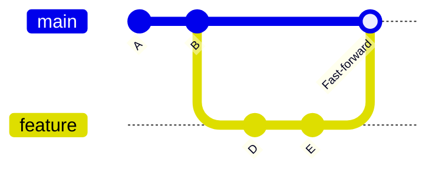
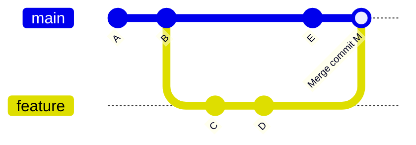
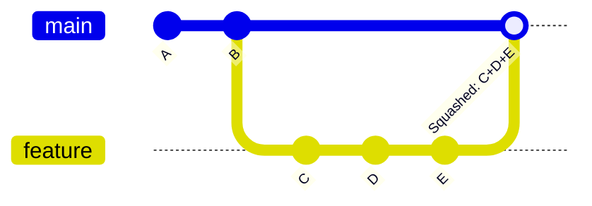

<div align="center">

<h1>Module 02 — Intermediate Workflows</h1>
<h3>Branching, Merging & Stashing</h3>

[](../README.md)
[](#)
[](#3-the-cheat-code-section)
[](#2-visual-diagrams)
[](#4-hands-on-lab)
[](../LICENSE)

**[← 01 Foundations](../01-Foundations/README.md) · [Course Home](../README.md) · [03 Remote Collaboration →](../03-Remote-Collaboration/README.md)**

</div>

---

## 📋 Module Contents

- [Learning Objectives](#-learning-objectives)
- [1. Theoretical Explanation](#1-theoretical-explanation)
  - [Branches as Lightweight Pointers](#branches-as-lightweight-pointers)
  - [HEAD: Where You Are](#head-where-you-are-right-now)
  - [git switch vs git checkout](#git-switch-modern-vs-git-checkout-legacy)
  - [Fast-Forward Merge](#fast-forward-merge)
  - [3-Way Merge](#3-way-recursive-merge)
  - [Squash Merge](#squash-merge)
  - [Stash](#stash-your-uncommitted-work-clipboard)
- [2. Visual Diagrams](#2-visual-diagrams)
- [3. The "Cheat Code" Section](#3-the-cheat-code-section)
- [4. Hands-on Lab](#4-hands-on-lab)

---

## 🎯 Learning Objectives

By the end of this module you will be able to:

1. Create and switch between branches.
2. Understand fast-forward vs. 3-way (recursive) merge.
3. Resolve merge conflicts.
4. Use stash for work-in-progress management.

---

## 1. Theoretical Explanation

### Branches as Lightweight Pointers

A **branch** in Git is nothing more than a lightweight, movable pointer to a single commit. When you create a branch, Git creates a 41-byte file containing the SHA of the commit it points to. That's it.

This is why branches in Git are so cheap to create and delete — there's no copying of files or history involved.

### HEAD: Where You Are Right Now

**HEAD** is a special pointer that tells Git "this is where you are right now." It almost always points to the tip of your current branch. When you make a new commit, HEAD (and the current branch pointer) moves forward to the new commit automatically.

When HEAD points directly to a commit SHA instead of a branch name, you're in **detached HEAD state** — this is expected when checking out old commits for inspection.

### `git switch` (Modern) vs. `git checkout` (Legacy)

| Task | Modern (Git 2.23+) | Legacy |
|---|---|---|
| Switch to existing branch | `git switch <name>` | `git checkout <name>` |
| Create and switch to new branch | `git switch -c <name>` | `git checkout -b <name>` |

> [!TIP]
> Prefer `git switch` over `git checkout` for branch operations in Git 2.23+.
> `git checkout` remains valid but does too many things — it switches branches, restores files, and checks out commits. `git switch` has a single, clear purpose.

### Fast-Forward Merge

A **fast-forward merge** is the simplest kind of merge. It's possible when the branch you're merging in is directly ahead of the branch you're merging into — there's a straight-line path between them with no divergence.

Git simply moves the target branch pointer forward to the tip of the incoming branch. **No merge commit is created.**

**When is it possible?** When the base branch hasn't received any new commits since the feature branch was created.

### 3-Way (Recursive) Merge

When both branches have moved forward independently, a fast-forward is impossible. Git needs to create a new **merge commit** that has two parents — one from each branch.

The three "ways" in a 3-way merge are:
1. **Common ancestor** — the commit where the two branches last shared history
2. **Branch A tip** — the most recent commit on the first branch
3. **Branch B tip** — the most recent commit on the second branch

Git uses the common ancestor to understand what changed on each side, then combines those changes. If the same area of the same file was changed differently on both sides, you get a **merge conflict** that must be resolved manually.

### Squash Merge

A **squash merge** collapses all commits from the feature branch into a single new commit on the target branch. The feature branch history is preserved locally but doesn't appear in the target branch's log. This keeps `main` history clean and readable.

Use it when: a feature branch has many "WIP" commits that aren't worth keeping individually.

### Stash: Your Uncommitted Work Clipboard

**Stash** is a temporary storage area for work you're not ready to commit. It's like putting your current work in a drawer, switching tasks, and then opening that drawer again later.

Common use case: you're mid-feature on one branch when an urgent bug comes in. You stash your WIP, fix the bug on another branch, and pop your stash when you return.

---

## 2. Visual Diagrams

### Diagram A — Fast-Forward Merge



### Diagram B — 3-Way Merge



### Diagram C — Squash Merge



---

## 3. The "Cheat Code" Section

| Command | Description |
|---|---|
| `git branch` | List all branches; active branch marked with `*` |
| `git branch <branch-name>` | Create a new branch at the current commit |
| `git branch --sort=-committerdate` | List branches sorted by most recently committed |
| `git branch -d <name>` | Delete a branch safely (only if fully merged) |
| `git branch -D <name>` | Force-delete a branch regardless of merge status |
| `git switch <name>` | Switch to an existing branch (modern, Git 2.23+) |
| `git switch -c <name>` | Create and switch to a new branch (modern) |
| `git checkout <name>` | Switch to a branch (legacy, still valid) |
| `git checkout -b <name>` | Create and switch to a new branch (legacy) |
| `git merge <branch>` | Merge specified branch into current branch |
| `git merge --squash <branch>` | Squash all commits from branch into one before merging |
| `git stash` | Save modified and staged changes to a temporary stack |
| `git stash list` | List all stashed changesets |
| `git stash pop` | Apply top stash entry and remove it from the stack |
| `git stash drop` | Discard the top stash entry without applying it |

---

## 4. Hands-on Lab

### Lab: "Feature Branch Workflow"

This is one of the most powerful tools in Git — the feature branch workflow is how professional teams collaborate every day.

**Step 1 — Create a feature branch:**  
In your repo from Module 01:
```bash
git switch -c feature/add-content
```

**Step 2 — Add a new file:**
```bash
echo "Feature content" > feature.txt
```

**Step 3 — Stage and commit:**
```bash
git add . && git commit -m "feat: add feature.txt"
```

**Step 4 — Switch back to main:**
```bash
git switch main
```

**Step 5 — Verify isolation:**  
Run `ls` — notice that `feature.txt` does **NOT** exist on main. This is branching working exactly as intended.

**Step 6 — Fast-forward merge:**
```bash
git merge feature/add-content
```
Observe the message: `Fast-forward`. No merge commit was needed.

**Step 7 — Clean up:**
```bash
git branch -d feature/add-content
```

**Step 8 — Trigger a 3-way merge:**  
Create a second feature branch:
```bash
git switch -c feature/diverge
echo "Branch line" > branch.txt && git add . && git commit -m "feat: add branch.txt"
```
Switch back to main and make a commit there too:
```bash
git switch main
echo "Main update" >> README.md && git add . && git commit -m "docs: update README on main"
```
Now merge:
```bash
git merge feature/diverge
```
Observe: this time Git creates a **merge commit** because both branches diverged.

**Step 9 — Practice stash:**
```bash
echo "Work in progress..." > wip.txt
git add wip.txt
git stash
```
Your WIP is saved. Switch to another branch, do some work, then come back:
```bash
git switch main
# ... do work ...
git switch -
git stash pop
```
Your `wip.txt` is back, staged and ready.

> [!TIP]
> `git switch -` (with a hyphen) switches back to the previous branch — like `cd -` in bash. Very handy!

---

<div align="center">

| ← Previous | Home | Next → |
|:---:|:---:|:---:|
| [01 — Foundations](../01-Foundations/README.md) | [📖 Course Home](../README.md) | [03 — Remote Collaboration](../03-Remote-Collaboration/README.md) |

**[📋 Full Cheat Sheet](../CHEATSHEET.md) · [🛠️ Practice Lab](../Practice-Lab/README.md) · [📄 License](../LICENSE)**

*Part of the free, open-source [GIT&GITHUB](../README.md) curriculum — MIT Licensed.*

</div>
