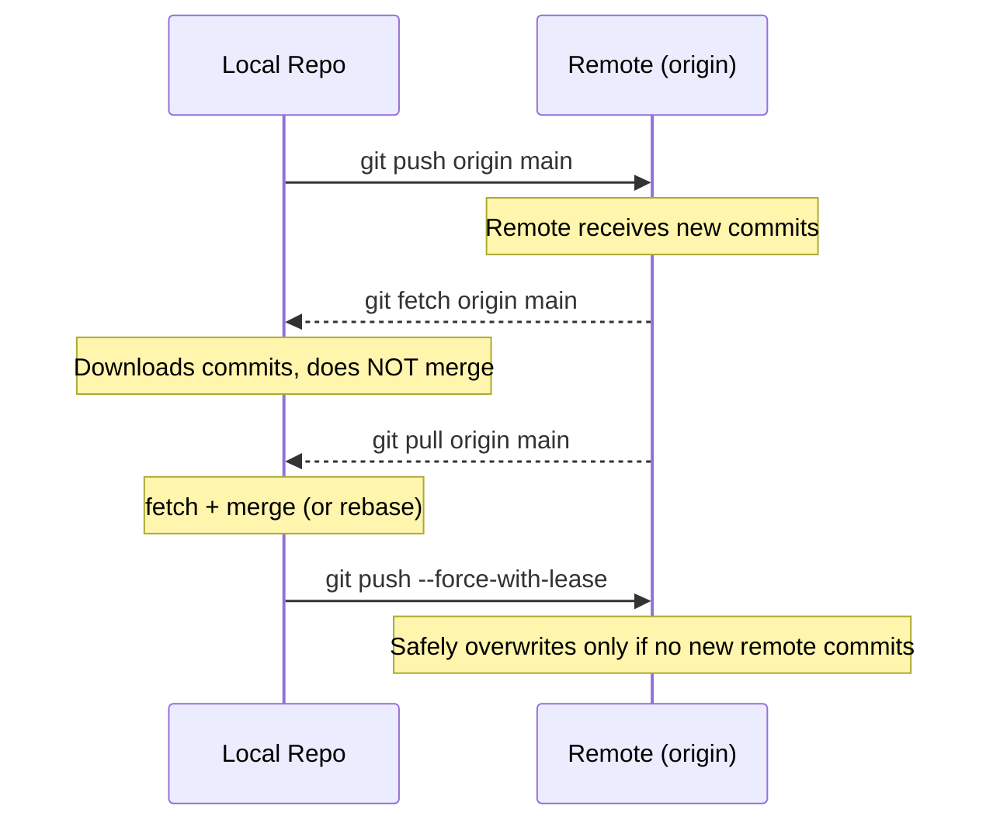

# Module 03 — Remote Collaboration: Remotes, Push, Pull & Pull Requests

## Learning Objectives

By the end of this module you will be able to:

1. Connect a local repository to a remote (GitHub).
2. Push and pull changes.
3. Understand fetch vs. pull.
4. Understand Pull Requests as a collaboration pattern.

---

## 1. Theoretical Explanation

### What Is a Remote?

A **remote** is a named pointer to a URL — usually a repository hosted on GitHub, GitLab, Bitbucket, or another server. Remotes let your local repository communicate with other copies of the repository.

You can have multiple remotes. By convention, the primary remote is named **`origin`**.

```bash
git remote add origin https://github.com/username/my-repo.git
```

After this command, `origin` is just an alias for that URL. Every time you push or fetch, Git knows where to talk to.

### `git fetch` vs. `git pull`

This distinction is one of the most important concepts in collaborative Git:

| Command | What it does | Is it safe? |
|---|---|---|
| `git fetch` | Downloads commits and branches from remote — **does not modify your working directory or local branches** | Always safe |
| `git pull` | Runs `git fetch` followed immediately by `git merge` (or `git rebase` with `--rebase`) | Merges automatically |

**Best practice:** Use `git fetch` first to see what changed, then decide whether to merge. Use `git pull` when you trust the remote and want a quick sync.

### `git pull --rebase` vs. `git pull`

| Command | Result |
|---|---|
| `git pull` | Creates a merge commit if diverged (messier history) |
| `git pull --rebase` | Replays your local commits on top of the fetched remote commits (cleaner linear history) |

Many teams configure `git pull --rebase` as the default behavior.

### Tracking Branches

A **tracking branch** is a local branch that knows which remote branch it corresponds to. When you run `git push -u origin main`, the `-u` flag sets up this tracking relationship. After that, you can run `git push` or `git pull` with no arguments and Git knows where to go.

### Force Push: `--force` vs. `--force-with-lease`

Force push overwrites the remote branch with your local branch. This is dangerous on shared branches.

- `--force`: Blindly overwrites the remote. If someone pushed a commit after your last fetch, **you will delete their work**.
- `--force-with-lease`: First checks if the remote has any commits you haven't seen. If it does, the push fails — protecting against accidental data loss.

> [!WARNING]
> Never force-push to a shared branch (e.g., `main`).
> Always prefer `--force-with-lease` over `--force` — it prevents overwriting others' work pushed since your last fetch.

### Pull Requests

A **Pull Request (PR)** is a GitHub UI concept layered on top of Git branches. Technically, it's just "I want to merge branch A into branch B." GitHub wraps it in:

- A conversation thread for code review
- A diff view showing every changed line
- CI/CD status checks
- A merge button

PRs are the standard collaboration pattern in open-source and professional software development.

---

## 2. Visual Diagram

Push/pull flow between a local repository and a remote:



---

## 3. The "Cheat Code" Section

| Command | Description |
|---|---|
| `git remote add <alias> <url>` | Add a remote URL with a named alias |
| `git remote add origin <url>` | Standard: name the remote "origin" (the convention) |
| `git fetch <alias>` | Download all branches from remote without merging |
| `git fetch origin main` | Fetch a specific remote branch |
| `git merge <alias>/<branch>` | Merge a remote-tracking branch into current branch |
| `git push <alias> <branch>` | Push a local branch to remote |
| `git push origin main` | Push local main to origin |
| `git push -u origin <name>` | Push new branch and set up tracking relationship |
| `git push --force-with-lease` | Force push safely — fails if remote has unseen commits |
| `git push --tags` | Push all local tags to remote |
| `git pull` | Fetch + merge from the tracking remote branch |
| `git pull origin main` | Fetch and merge a specific remote branch |
| `git pull --rebase` | Fetch + rebase instead of merge (linear history) |
| `git clone <url>` | Clone a full repository from a remote URL |

---

## 4. Hands-on Lab

### Lab: "Connect to GitHub and Collaborate"

This is the skill that makes Git truly powerful — connecting your local work to the world.

**Prerequisites:** A GitHub account and a local repo from Module 01.

**Step 1 — Create a new GitHub repository:**  
- Go to github.com → New repository
- Name it `my-first-repo`
- Do **not** initialize with a README (your local repo already has history)
- Click **Create repository**

**Step 2 — Connect your local repo:**
```bash
git remote add origin https://github.com/YOUR-USERNAME/my-first-repo.git
```

**Step 3 — Push main:**
```bash
git push -u origin main
```
The `-u` flag sets up tracking — future pushes can just be `git push`.

**Step 4 — Verify on GitHub:**  
Refresh your GitHub repo page. You should see your files!

**Step 5 — Make a change in the GitHub UI:**  
- Click on `README.md` in GitHub
- Click the pencil (edit) icon
- Add a line of text
- Scroll down and click **Commit changes**

**Step 6 — Pull the change locally:**
```bash
git pull origin main
```
Open your local `README.md` — it should now reflect the edit you made on GitHub.

**Step 7 — Push a new branch:**
```bash
git switch -c feature/my-feature
echo "New feature content" > new-feature.md
git add . && git commit -m "feat: add new feature file"
git push -u origin feature/my-feature
```

**Step 8 — Open a Pull Request:**  
- Go to your GitHub repo
- GitHub will show a banner: "Compare & pull request" — click it
- Add a title and description, then click **Create pull request**

**Step 9 — Merge the PR:**  
Click **Merge pull request** → **Confirm merge** in GitHub.

**Step 10 — Sync your local main:**
```bash
git switch main
git pull origin main
```
Your local main now includes the feature you merged via PR.

> [!TIP]
> After merging a PR, always `git pull` your local main to stay in sync. Make this a habit before starting any new feature branch.

---

**Previous:** [02-Intermediate-Workflows ←](../02-Intermediate-Workflows/README.md)  
**Next:** [04-Advanced-Git →](../04-Advanced-Git/README.md)  
**Cheat Sheet:** [Full Command Reference →](../CHEATSHEET.md)
