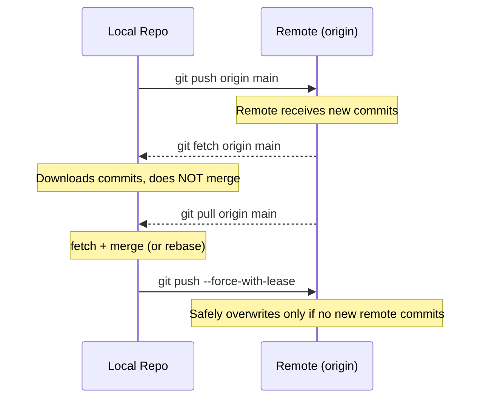

<div align="center">

<h1>Module 03 — Remote Collaboration</h1>
<h3>Remotes, Push, Pull & Pull Requests</h3>

[](../README.md)
[](#)
[](#3-the-cheat-code-section)
[](#4-hands-on-lab)
[](#-prerequisites)
[](../LICENSE)

**[← 02 Intermediate Workflows](../02-Intermediate-Workflows/README.md) · [Course Home](../README.md) · [04 Advanced Git →](../04-Advanced-Git/README.md)**

</div>

---

## 📋 Module Contents

- [Prerequisites](#-prerequisites)
- [Learning Objectives](#-learning-objectives)
- [1. Theoretical Explanation](#1-theoretical-explanation)
  - [What Is a Remote?](#what-is-a-remote)
  - [git fetch vs git pull](#git-fetch-vs-git-pull)
  - [git pull --rebase vs git pull](#git-pull---rebase-vs-git-pull)
  - [Tracking Branches](#tracking-branches)
  - [Force Push Safety](#force-push---force-vs---force-with-lease)
  - [Pull Requests](#pull-requests)
- [2. Visual Diagram](#2-visual-diagram)
- [3. The "Cheat Code" Section](#3-the-cheat-code-section)
- [4. Hands-on Lab](#4-hands-on-lab)

---

## ⚠️ Prerequisites

This module requires a **free GitHub account**. If you don't have one:

1. Go to [github.com/signup](https://github.com/signup)
2. Create a free account — no credit card required
3. Verify your email address

A GitHub account is free and always will be for public and personal use.

---

## 🎯 Learning Objectives

By the end of this module you will be able to:

1. Connect a local repository to a remote (GitHub).
2. Push and pull changes.
3. Understand fetch vs. pull.
4. Understand Pull Requests as a collaboration pattern.

---

## 1. Theoretical Explanation

### What Is a Remote?

A **remote** is a named pointer to a URL — usually a repository hosted on GitHub, GitLab, Bitbucket, or another server. Remotes let your local repository communicate with other copies of the repository.

You can have multiple remotes. By convention, the primary remote is named **`origin`**.

```bash
git remote add origin https://github.com/username/my-repo.git
```

After this command, `origin` is just an alias for that URL. Every time you push or fetch, Git knows where to talk to.

### `git push` — What Exactly Happens?

When you run `git push origin main`, here is the exact sequence of events:

1. Git reads your local `main` branch and finds all commits that the remote doesn't have yet
2. Git packages those commits and uploads them to the GitHub server over HTTPS or SSH
3. GitHub adds those commits to its copy of the repository
4. GitHub updates its `main` branch pointer to match yours
5. Git updates your **remote tracking ref** `origin/main` to match

```bash
git push origin main
# Read as: "Push my local 'main' branch to the remote named 'origin'"
```

**First push of a new branch:**
```bash
git push -u origin feature/login
# -u sets up "tracking" — links your local branch to the remote one
# After this, you can just type: git push (no need to specify origin/branch again)
```

**What `origin/main` is:** It's a read-only snapshot of what `main` looked like on the remote the last time you fetched or pushed. It lives in your local `.git/refs/remotes/origin/main`. It's not the same as your local `main`.

---

### HTTPS vs SSH — Two Ways to Authenticate With GitHub

When you clone or push to GitHub, you need to prove who you are. GitHub supports two methods:

**HTTPS (the default, easiest to set up):**
```bash
git clone https://github.com/abhishek01dev/Git-Github.git
```
- Uses a URL starting with `https://`
- Git will ask for your GitHub username and password (or Personal Access Token)
- Personal Access Tokens (PAT) are required since 2021 — plain passwords no longer work
- Generate a PAT at: GitHub → Settings → Developer Settings → Personal access tokens

**SSH (more secure, more convenient once set up):**
```bash
git clone git@github.com:abhishek01dev/Git-Github.git
```
- Uses a URL starting with `git@github.com:`
- Uses an SSH key pair — no password prompts once configured
- Setup steps:
  ```bash
  # 1. Generate an SSH key (only once ever)
  ssh-keygen -t ed25519 -C "your@email.com"

  # 2. Copy your public key
  cat ~/.ssh/id_ed25519.pub   # Copy this entire output

  # 3. Add it to GitHub
  # GitHub → Settings → SSH and GPG keys → New SSH key → Paste
  
  # 4. Test the connection
  ssh -T git@github.com
  # Hi abhishek01dev! You've successfully authenticated.
  ```

| | HTTPS | SSH |
|---|---|---|
| Setup effort | Minimal | One-time key generation |
| Daily use | Token prompt (unless cached) | Silent, no prompts |
| Behind firewalls | Works everywhere | Port 22 sometimes blocked |
| Best for | Beginners, quick setup | Daily use on your own machine |

**Switch an existing repo from HTTPS to SSH:**
```bash
git remote set-url origin git@github.com:abhishek01dev/Git-Github.git
```

---

### Managing Your Remotes

You can have more than one remote. This is common when you fork a repo — you have `origin` (your fork) and `upstream` (the original).

```bash
# See all remotes
git remote -v

# Add a remote
git remote add upstream https://github.com/original-author/repo.git

# Rename a remote
git remote rename origin old-origin

# Change a remote's URL
git remote set-url origin https://github.com/abhishek01dev/Git-Github.git

# Remove a remote (only removes the reference, doesn't delete anything)
git remote remove upstream

# Get detailed info about a remote
git remote show origin
```

**Common two-remote setup (fork workflow):**
```bash
# origin  = YOUR fork (you push to this)
# upstream = original repo (you fetch updates from this)

git fetch upstream        # Get the latest from original
git merge upstream/main   # Merge it into your local main
git push origin main      # Push the updated main to YOUR fork
```

---

### `git fetch` vs. `git pull`

This distinction is one of the most important concepts in collaborative Git:

| Command | What it does | Is it safe? |
|---|---|---|
| `git fetch` | Downloads commits and branches from remote — **does not modify your working directory or local branches** | Always safe |
| `git pull` | Runs `git fetch` followed immediately by `git merge` (or `git rebase` with `--rebase`) | Merges automatically |

**A plain-English analogy:**

Imagine your team uses a shared Google Doc, but you work on a local printed copy.

- `git fetch` = going to the office and **photocopying** the latest Google Doc. Your printed copy is unchanged. You can compare before deciding what to do.
- `git pull` = going to the office, photocopying it, and immediately **scribbling those changes onto your printed copy**. Faster, but you have less control.

```bash
# git fetch — safe inspection first
git fetch origin
git log HEAD..origin/main --oneline   # See what they have that you don't
git diff HEAD origin/main             # See the actual changes
git merge origin/main                 # NOW decide to merge

# git pull — fetch + merge in one step
git pull origin main
```

**Best practice:** Use `git fetch` first to see what changed, then decide whether to merge. Use `git pull` when you trust the remote and want a quick sync.

### `git pull --rebase` vs. `git pull`

| Command | Result |
|---|---|
| `git pull` | Creates a merge commit if diverged (messier history) |
| `git pull --rebase` | Replays your local commits on top of the fetched remote commits (cleaner linear history) |

Many teams configure `git pull --rebase` as the default behavior.

### Tracking Branches

A **tracking branch** is a local branch that knows which remote branch it corresponds to. When you run `git push -u origin main`, the `-u` flag sets up this tracking relationship. After that, you can run `git push` or `git pull` with no arguments and Git knows where to go.

### Force Push: `--force` vs. `--force-with-lease`

Force push overwrites the remote branch with your local branch. This is dangerous on shared branches.

- `--force`: Blindly overwrites the remote. If someone pushed a commit after your last fetch, **you will delete their work**.
- `--force-with-lease`: First checks if the remote has any commits you haven't seen. If it does, the push fails — protecting against accidental data loss.

> [!WARNING]
> Never force-push to a shared branch (e.g., `main`).
> Always prefer `--force-with-lease` over `--force` — it prevents overwriting others' work pushed since your last fetch.

### Pull Requests

A **Pull Request (PR)** is a GitHub UI concept layered on top of Git branches. Technically, it's just "I want to merge branch A into branch B." GitHub wraps it in:

- A conversation thread for code review
- A diff view showing every changed line
- CI/CD status checks
- A merge button

PRs are the standard collaboration pattern in open-source and professional software development.

---

## 2. Visual Diagram

Push/pull flow between a local repository and a remote:



---

## 3. The "Cheat Code" Section

| Command | Description |
|---|---|
| `git remote add <alias> <url>` | Add a remote URL with a named alias |
| `git remote add origin <url>` | Standard: name the remote "origin" (the convention) |
| `git fetch <alias>` | Download all branches from remote without merging |
| `git fetch origin main` | Fetch a specific remote branch |
| `git merge <alias>/<branch>` | Merge a remote-tracking branch into current branch |
| `git push <alias> <branch>` | Push a local branch to remote |
| `git push origin main` | Push local main to origin |
| `git push -u origin <name>` | Push new branch and set up tracking relationship |
| `git push --force-with-lease` | Force push safely — fails if remote has unseen commits |
| `git push --tags` | Push all local tags to remote |
| `git pull` | Fetch + merge from the tracking remote branch |
| `git pull origin main` | Fetch and merge a specific remote branch |
| `git pull --rebase` | Fetch + rebase instead of merge (linear history) |
| `git clone <url>` | Clone a full repository from a remote URL |

---

## 4. Hands-on Lab

### Lab: "Connect to GitHub and Collaborate"

This is the skill that makes Git truly powerful — connecting your local work to the world.

**Prerequisites:** A GitHub account and a local repo from Module 01.

**Step 1 — Create a new GitHub repository:**  
- Go to github.com → New repository
- Name it `my-first-repo`
- Do **not** initialize with a README (your local repo already has history)
- Click **Create repository**

**Step 2 — Connect your local repo:**
```bash
git remote add origin https://github.com/abhishek01dev/my-first-repo.git
```

**Step 3 — Push main:**
```bash
git push -u origin main
```
The `-u` flag sets up tracking — future pushes can just be `git push`.

**Step 4 — Verify on GitHub:**  
Refresh your GitHub repo page. You should see your files!

**Step 5 — Make a change in the GitHub UI:**  
- Click on `README.md` in GitHub
- Click the pencil (edit) icon
- Add a line of text
- Scroll down and click **Commit changes**

**Step 6 — Pull the change locally:**
```bash
git pull origin main
```
Open your local `README.md` — it should now reflect the edit you made on GitHub.

**Step 7 — Push a new branch:**
```bash
git switch -c feature/my-feature
echo "New feature content" > new-feature.md
git add . && git commit -m "feat: add new feature file"
git push -u origin feature/my-feature
```

**Step 8 — Open a Pull Request:**  
- Go to your GitHub repo
- GitHub will show a banner: "Compare & pull request" — click it
- Add a title and description, then click **Create pull request**

**Step 9 — Merge the PR:**  
Click **Merge pull request** → **Confirm merge** in GitHub.

**Step 10 — Sync your local main:**
```bash
git switch main
git pull origin main
```
Your local main now includes the feature you merged via PR.

> [!TIP]
> After merging a PR, always `git pull` your local main to stay in sync. Make this a habit before starting any new feature branch.

---

## 5. 🏋️ Practice Exercises

> Remote collaboration is where Git becomes a team sport. These exercises simulate the real daily workflow used by professional engineering teams.

---

### Exercise 1 — Verify Your Remote Setup
Before pushing anything, always confirm your remote is correctly pointed.

**Task:**
```bash
# Check your remotes
git remote -v

# Should show:
# origin  https://github.com/abhishek01dev/Git-Github.git (fetch)
# origin  https://github.com/abhishek01dev/Git-Github.git (push)

# Get more detail about the origin remote
git remote show origin
```

- [ ] **Done** when you can see both fetch and push URLs pointing to your repository
- [ ] **Done** when `git remote show origin` shows which local branch tracks which remote branch

> [!TIP]
> If the remote URL is wrong, fix it without deleting and re-adding: `git remote set-url origin <correct-url>`

---

### Exercise 2 — Push ONLY a Feature Branch (Not Main)
Practice pushing a specific branch rather than always pushing main.

**Task:**
```bash
# Create a feature branch with one commit
git switch -c feature/exercise-remote
echo "Remote exercise content" > remote-test.txt
git add remote-test.txt
git commit -m "feat: add remote test file"

# Push ONLY this branch — main is NOT pushed
git push -u origin feature/exercise-remote

# Verify: check GitHub — you should see the new branch in the branches dropdown
# But main should be unchanged
```

- [ ] **Done** when your GitHub repo shows `feature/exercise-remote` branch in the branches list
- [ ] **Done** when the file `remote-test.txt` exists on the remote branch but NOT on main

**Cleanup after:**
```bash
git switch main
git branch -d feature/exercise-remote
git push origin --delete feature/exercise-remote  # Delete remote branch too
```

---

### Exercise 3 — Fetch vs Pull: Feel the Difference
Experience firsthand why `git fetch` is safer than `git pull`.

**Task:**

First, make a change directly in GitHub's UI:
1. Go to your repo on GitHub
2. Edit `README.md` online — add any line
3. Commit it directly on `main` in GitHub

Now back in your terminal:
```bash
# Step A: fetch only (SAFE — doesn't change your local files)
git fetch origin main
git status
# You'll see: "Your branch is behind 'origin/main' by 1 commit"

# Step B: See what changed BEFORE merging
git log HEAD..origin/main --oneline
# This shows commits on remote that you don't have locally

# Step C: Look at the actual diff
git diff HEAD origin/main

# Step D: Now decide to merge (or rebase)
git merge origin/main
```

- [ ] **Done** when your local README matches the GitHub version after the merge

**The point:** `git fetch` let you inspect the change before accepting it. `git pull` would have merged blindly. Fetch first, inspect, then merge — always.

---

### Exercise 4 — Simulate a Rejected Push and Fix It
This is the most common error new Git users panic about. Practice it so it becomes routine.

**Setup:** Make the remote "ahead" of your local branch.
1. Make a commit directly on GitHub (edit any file in the UI)

**Then on your local machine — without pulling — make a different commit:**
```bash
echo "Local change" >> README.md
git add README.md
git commit -m "docs: local change"

# Try to push — this will FAIL
git push origin main
```

You'll see:
```
! [rejected]  main -> main (fetch first)
error: failed to push some refs to 'origin'
hint: Updates were rejected because the remote contains work that you do not
hint: have locally.
```

**Fix it (Option A — merge approach):**
```bash
git pull origin main        # fetch + merge the remote commit
git push origin main        # now push succeeds
```

**Fix it (Option B — rebase approach, cleaner history):**
```bash
git pull --rebase origin main    # fetch + rebase your commit on top
git push origin main
```

- [ ] **Done** when `git push origin main` succeeds after the fix
- [ ] **Done** when `git log --oneline` shows both commits (the remote one AND yours)

> [!WARNING]
> Never use `git push --force` to solve a rejected push on a shared branch. It erases the remote commit. Always fetch/pull first, resolve any conflicts, then push.

---

### Exercise 5 — Full Pull Request Cycle
Practice the complete team workflow: branch → commit → push → PR → merge → sync.

**Task:**
```bash
# 1. Create a feature branch
git switch -c feature/pr-practice

# 2. Add meaningful work
echo "# PR Practice" > pr-notes.txt
echo "This file was created through a PR workflow." >> pr-notes.txt
git add pr-notes.txt
git commit -m "docs: add PR practice notes"

# 3. Push the branch
git push -u origin feature/pr-practice
```

On GitHub:
4. GitHub shows a "Compare & pull request" banner — click it
5. Write a PR title: `docs: add PR practice notes`
6. Write a description explaining what the PR does
7. Click **Create pull request**
8. Review the "Files changed" tab — see your diff
9. Click **Merge pull request** → **Confirm merge**
10. Click **Delete branch** (good hygiene)

Back in your terminal:
```bash
# 11. Sync your local main with the merged PR
git switch main
git pull origin main
git branch -d feature/pr-practice   # Delete local branch too

# 12. Verify
git log --oneline -3
```

- [ ] **Done** when `git log --oneline` on local main shows the PR commit at the top

---

### Exercise 6 — Track a Remote Branch That Already Exists
Practice connecting a local branch to an existing remote branch.

**Task:**
1. Create a branch directly on GitHub (use the branch dropdown → type a new name → press Enter)
2. Name it `feature/github-created`

Back in terminal:
```bash
# Fetch the new remote branch (it doesn't exist locally yet)
git fetch origin

# Create a local branch that tracks the remote one
git switch --track origin/feature/github-created
# or equivalently:
# git checkout -b feature/github-created origin/feature/github-created

# Verify tracking is set up
git branch -vv
# Output shows: feature/github-created ... [origin/feature/github-created]
```

- [ ] **Done** when `git branch -vv` shows the tracking relationship in brackets

---

### 🎯 Module 03 Self-Assessment

| Challenge | Confident? |
|---|:---:|
| Verify and fix a remote URL | ☐ Yes ☐ Need practice |
| Push a specific branch (not main) | ☐ Yes ☐ Need practice |
| Explain the difference between fetch and pull | ☐ Yes ☐ Need practice |
| Recover from a rejected push without force-push | ☐ Yes ☐ Need practice |
| Open, review, merge, and clean up a Pull Request | ☐ Yes ☐ Need practice |
| Set up tracking between a local and remote branch | ☐ Yes ☐ Need practice |

---

<div align="center">

| ← Previous | Home | Next → |
|:---:|:---:|:---:|
| [02 — Intermediate Workflows](../02-Intermediate-Workflows/README.md) | [📖 Course Home](../README.md) | [04 — Advanced Git](../04-Advanced-Git/README.md) |

**[📋 Full Cheat Sheet](../CHEATSHEET.md) · [🛠️ Practice Lab](../Practice-Lab/README.md) · [📄 License](../LICENSE)**

*Part of the free, open-source [GIT&GITHUB](../README.md) curriculum — MIT Licensed.*

</div>
