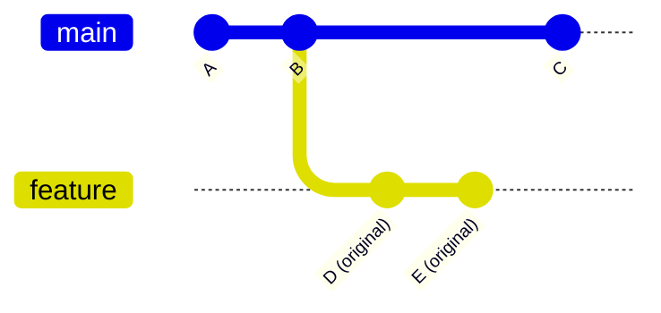
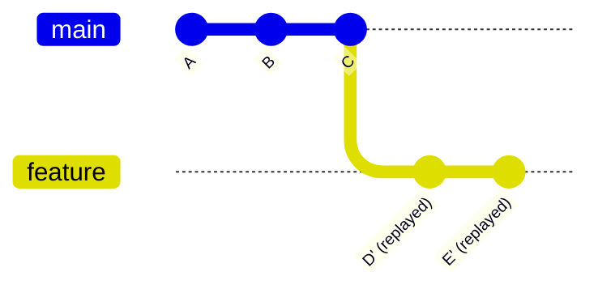
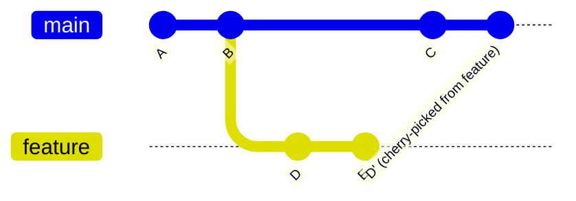

<div align="center">

<h1>Module 04 — Advanced Git</h1>
<h3>Rebase, Cherry-pick, Reflog & History Rewriting</h3>

[](../README.md)
[](#)
[](#3-the-cheat-code-section)
[](#2-visual-diagrams)
[](#4-hands-on-lab)
[](../LICENSE)

**[← 03 Remote Collaboration](../03-Remote-Collaboration/README.md) · [Course Home](../README.md) · [05 GitHub Expertise →](../05-GitHub-Expertise/README.md)**

> [!WARNING]
> This module covers commands that **rewrite commit history**. Understand each command before running it. The lab is designed to be safe — always work on a practice branch, never on `main`.

</div>

---

## 📋 Module Contents

- [Learning Objectives](#-learning-objectives)
- [1. Theoretical Explanation](#1-theoretical-explanation)
  - [Rebase: Replaying Commits](#rebase-replaying-commits)
  - [Interactive Rebase (-i)](#interactive-rebase--i)
  - [Cherry-Pick: Copying a Commit](#cherry-pick-copying-a-commit)
  - [Reflog: Git's Undo History](#reflog-gits-undo-history)
  - [git reset — Three Modes](#git-reset--three-modes)
  - [git commit --amend](#git-commit---amend)
  - [git restore](#git-restore-file)
- [2. Visual Diagrams](#2-visual-diagrams)
- [3. The "Cheat Code" Section](#3-the-cheat-code-section)
- [4. Hands-on Lab](#4-hands-on-lab)

---

## 🎯 Learning Objectives

By the end of this module you will be able to:

1. Rebase a branch onto another.
2. Interactively squash and reorder commits.
3. Cherry-pick individual commits.
4. Use reflog to recover from mistakes.
5. Understand `git reset` hard/soft/mixed.

---

## 1. Theoretical Explanation

### Rebase: Replaying Commits

**Rebase** takes the commits on your current branch and replays them one by one on top of another branch. Each replayed commit gets a brand-new SHA — even if the content is identical — because its parent commit has changed.

**Why use rebase?**
- Keeps a clean, linear history (no merge commits cluttering `git log`)
- Makes it look like your feature was built on top of the latest main, even if you branched from an older commit
- Makes code review easier — reviewers see a clean sequence of changes

> [!WARNING]
> Rebasing rewrites commit history. **Never rebase a branch that others are currently working on.** If you push a rebased branch that others have based work on, their history diverges and they'll face painful conflicts.

### Interactive Rebase (`-i`)

`git rebase -i HEAD~N` opens an editor with the last N commits listed. You can:

| Action | Effect |
|---|---|
| `pick` | Keep the commit as-is (default) |
| `squash` (s) | Combine this commit with the previous one; merge messages |
| `fixup` (f) | Combine with previous commit; discard this commit's message |
| `reword` (r) | Keep the commit but edit its message |
| `drop` (d) | Delete the commit entirely |
| `edit` (e) | Pause and let you amend the commit |

### Cherry-Pick: Copying a Commit

`git cherry-pick <SHA>` copies a single commit from anywhere in history onto the current branch. The original commit stays where it was; a new commit with the same changes (but a new SHA) is added to your current branch.

Use cases:
- Backporting a bug fix to a release branch
- Grabbing one feature commit from a larger branch that's not ready to merge

### Reflog: Git's Undo History

The **reflog** records every position HEAD has been at — every commit, every reset, every checkout, every rebase step. It's stored locally and retained for ~30 days by default.

This is your ultimate safety net. Even if you do `git reset --hard` and "lose" commits, the reflog has their SHAs.

> [!NOTE]
> `git reflog` is your safety net. Even after `git reset --hard`, commits are recoverable for ~30 days via the reflog. Run `git reflog BRANCHNAME` to find the SHA of the commit you want to recover, then `git reset --hard <SHA>` to restore it.

### `git reset` — Three Modes

| Command | Moves HEAD? | Clears Staging Area? | Clears Working Directory? | Use For |
|---|---|---|---|---|
| `git reset HEAD^` (mixed, default) | Yes | Yes | No | Undo last commit, keep changes staged/unstaged |
| `git reset --soft HEAD^` | Yes | No | No | Undo last commit, keep changes staged |
| `git reset --hard <commit>` | Yes | Yes | **Yes** | Nuclear reset — all changes gone |

> [!WARNING]
> `git reset --hard` is destructive — it permanently discards all uncommitted changes in both the staging area and the working directory. Use with extreme caution.

### `git commit --amend`

Amend modifies the **most recent commit**. You can:
- Change the commit message
- Add files you forgot to stage

```bash
# Forgot to add a file:
git add forgotten-file.txt
git commit --amend --no-edit  # keeps existing message

# Change the commit message:
git commit --amend -m "Better commit message"
```

> [!WARNING]
> Amending rewrites the commit (new SHA). Never amend a commit that has already been pushed to a shared remote.

### `git restore <file>`

A modern, focused command for discarding changes:
- `git restore <file>` — discard unstaged changes to one file
- `git restore --staged --worktree <file>` — discard all staged and unstaged changes to one file
- `git restore <file> --source <commit>` — restore a file to its state at a specific commit

---

## 2. Visual Diagrams

### Diagram A — Rebase (Before and After)

Before rebase — `feature` branched from an older `main`:


After `git rebase main` — commits replayed on top of C:


### Diagram B — Cherry-Pick



---

## 3. The "Cheat Code" Section

| Command | Description |
|---|---|
| `git rebase <branch>` | Apply commits of current branch ahead of specified branch |
| `git rebase -i HEAD~6` | Interactively rebase last 6 commits (squash, fixup, reorder, drop) |
| `git reset HEAD^` | Undo last commit; keep changes in working directory |
| `git reset --hard <commit>` | Move HEAD to commit and discard all subsequent changes |
| `git reset --hard` | Delete all staged and unstaged changes (destructive!) |
| `git commit --amend` | Edit the most recent commit message or add a forgotten file |
| `git cherry-pick <commit>` | Copy a single commit onto the current branch |
| `git reflog BRANCHNAME` | Find commit IDs in reflog to recover from a failed rebase or reset |
| `git restore <file>` | Discard unstaged changes to one file |
| `git restore --staged --worktree <file>` | Discard all staged and unstaged changes to one file |
| `git restore <file> --source <commit>` | Restore a file to its state at a specific commit |
| `git clean` | Delete untracked files from working directory |
| `git show <SHA>` | Show any object in Git in human-readable format |

---

## 4. Hands-on Lab

### Lab: "Clean Up History with Interactive Rebase"

This is one of the most powerful tools in Git for maintaining a professional commit history.

**Step 1 — Create a practice branch:**
```bash
git switch -c cleanup-practice
```

**Step 2 — Make 5 quick commits:**
```bash
echo "Word 1" >> story.txt && git add . && git commit -m "wip: add word 1"
echo "Word 2" >> story.txt && git add . && git commit -m "wip: add word 2"
echo "Word 3" >> story.txt && git add . && git commit -m "wip: add word 3"
echo "Word 4" >> story.txt && git add . && git commit -m "wip: add word 4"
echo "Word 5" >> story.txt && git add . && git commit -m "wip: add word 5"
```

**Step 3 — See the messy history:**
```bash
git log --oneline
```
You'll see 5 separate "wip" commits.

**Step 4 — Start interactive rebase:**
```bash
git rebase -i HEAD~5
```
Your editor opens with 5 lines like:
```
pick abc1234 wip: add word 1
pick def5678 wip: add word 2
pick ghi9012 wip: add word 3
pick jkl3456 wip: add word 4
pick mno7890 wip: add word 5
```

**Step 5 — Squash commits 2–5 into commit 1:**  
Change `pick` to `fixup` (or `f`) for lines 2–5:
```
pick abc1234 wip: add word 1
fixup def5678 wip: add word 2
fixup ghi9012 wip: add word 3
fixup jkl3456 wip: add word 4
fixup mno7890 wip: add word 5
```
Save and exit the editor.

**Step 6 — Verify the clean history:**
```bash
git log --oneline
```
You now have 1 combined commit instead of 5.

**Step 7 — Rename the commit message:**
```bash
git commit --amend -m "feat: build initial story with 5 words"
```

**Step 8 — Practice recovery:**  
Deliberately "lose" the commit:
```bash
git reset --hard HEAD~1
git log --oneline
```
The commit appears gone!

**Step 9 — Use reflog to find it:**
```bash
git reflog cleanup-practice
```
Find the SHA of your "lost" commit (look for the line before the reset).

**Step 10 — Recover:**
```bash
git reset --hard <SHA>
git log --oneline
```
Your commit is back. You've got this — the reflog is always watching.

> [!TIP]
> Before any risky operation (hard reset, rebase, amend), note your current commit SHA with `git log --oneline -1`. If something goes wrong, you have the SHA ready for reflog recovery.

---

## 5. 🏋️ Practice Exercises

> These are the commands senior engineers use every single day. Practice each one deliberately — the muscle memory will save you in production situations.

---

### Exercise 1 — Fix a Bad Commit Message (Amend)
You committed with a typo or a vague message. Fix it before it's public.

**Task:**
```bash
mkdir amend-practice && cd amend-practice
git init
echo "some work" > work.txt
git add work.txt
git commit -m "feat: add wrk file"   # intentional typo: "wrk"

# Check the bad message
git log --oneline

# Fix it with amend
git commit --amend -m "feat: add work file"

# Verify the fix
git log --oneline
```

- [ ] **Done** when `git log --oneline` shows the corrected message
- [ ] Notice the SHA changed — amend creates a new commit

> [!WARNING]
> Only amend commits that have NOT been pushed to a shared remote. Amending a pushed commit rewrites history and will force-push everyone on the team into confusion.

---

### Exercise 2 — Add a Forgotten File to Last Commit
You committed and immediately realized you forgot to include a file.

**Task:**
```bash
mkdir forgot-file && cd forgot-file
git init
echo "main file" > main.txt
git add main.txt && git commit -m "feat: add main file"

# Oops — forgot config.txt
echo "database_url=localhost" > config.txt

# Add it to the LAST commit without changing the message
git add config.txt
git commit --amend --no-edit

# Verify both files are in the commit
git show --stat HEAD
```

- [ ] **Done** when `git show --stat HEAD` shows both `main.txt` AND `config.txt` in the last commit
- [ ] Notice the total commit count is still 1 — not 2

---

### Exercise 3 — Squash Messy WIP Commits into One Clean Commit
The most common use of interactive rebase: clean up before opening a PR.

**Setup:**
```bash
mkdir squash-practice && cd squash-practice
git init && echo "base" > base.txt && git add . && git commit -m "init"
git switch -c feature/messy-history

# Make 4 quick "wip" commits (this is realistic work-in-progress)
echo "step 1" >> feature.txt && git add . && git commit -m "wip"
echo "step 2" >> feature.txt && git add . && git commit -m "wip 2"
echo "step 3" >> feature.txt && git add . && git commit -m "fix typo"
echo "step 4" >> feature.txt && git add . && git commit -m "wip final"

git log --oneline   # 4 messy commits
```

**Task:** Squash all 4 into one clean commit using interactive rebase.
```bash
git rebase -i HEAD~4
```

In the editor that opens, change lines 2–4 from `pick` to `fixup`:
```
pick  <sha>  wip
fixup <sha>  wip 2
fixup <sha>  fix typo
fixup <sha>  wip final
```

Save and exit. Then rename the single resulting commit:
```bash
git commit --amend -m "feat: implement feature in 4 steps"
git log --oneline   # Should show 1 clean commit (+ init)
```

- [ ] **Done** when `git log --oneline` on the feature branch shows exactly 2 commits total

---

### Exercise 4 — Rebase a Branch onto Main (Linear History)
Clean up your feature branch so it looks like it was built on the latest main.

**Task:**
```bash
mkdir rebase-onto && cd rebase-onto
git init && echo "init" > base.txt && git add . && git commit -m "init"

# Create feature branch from this point
git switch -c feature/rebase-me
echo "feature work" > feature.txt
git add . && git commit -m "feat: feature work"

# Meanwhile, main gets a new commit (simulating teammate work)
git switch main
echo "teammate work" > teammate.txt
git add . && git commit -m "feat: teammate's commit"

# Check the graph BEFORE rebase
git log --oneline --graph --all
# You'll see two diverging paths

# Rebase feature onto main
git switch feature/rebase-me
git rebase main

# Check the graph AFTER rebase
git log --oneline --graph --all
# Now it's a straight line — feature is on TOP of main
```

- [ ] **Done** when the graph after rebase shows a linear history (no fork)
- [ ] Notice the feature commit has a NEW SHA — rebase rewrites commits

---

### Exercise 5 — Cherry-Pick a Specific Commit
Copy one useful commit onto a different branch without merging the whole branch.

**Scenario:** A bug fix was committed on `feature/experimental` but you need it on `main` right now — without merging the unfinished feature.

**Task:**
```bash
mkdir cherry-pick && cd cherry-pick
git init && echo "v1" > app.txt && git add . && git commit -m "init: app v1"

# Create a feature branch with multiple commits
git switch -c feature/experimental
echo "experimental stuff" >> app.txt && git add . && git commit -m "feat: experimental"
echo "fix: null pointer bug" >> app.txt && git add . && git commit -m "fix: null pointer bug"
echo "more experiments" >> app.txt && git add . && git commit -m "feat: more experiments"

# Get the SHA of ONLY the bug fix commit
git log --oneline feature/experimental
# Copy the SHA of "fix: null pointer bug"

# Back to main — cherry-pick ONLY the bug fix
git switch main
git cherry-pick <SHA-of-the-bugfix-commit>

# Verify: main has the bug fix but NOT the experimental work
git log --oneline main
```

- [ ] **Done** when `git log --oneline main` shows the cherry-picked bug fix commit
- [ ] Verify with `cat app.txt` on main — it should have the null pointer fix content but NOT "experimental stuff"

---

### Exercise 6 — The Full Reflog Recovery Drill
This is the most important recovery skill in Git. Practice until it feels routine.

**Task:**
```bash
mkdir reflog-drill && cd reflog-drill
git init
echo "precious work" > precious.txt
git add . && git commit -m "feat: precious work (DO NOT LOSE THIS)"
echo "more precious work" >> precious.txt
git add . && git commit -m "feat: more precious work"

# Note your current position
git log --oneline
# Let's say: abc1234 feat: more precious work

# DISASTER: hard reset to 2 commits ago
git reset --hard HEAD~2

# The commits are "gone"
git log --oneline   # Only the init commit?? Where's precious work??

# RECOVERY: use reflog to find what was lost
git reflog
# Look for lines like: abc1234 HEAD@{1}: commit: feat: more precious work

# Restore the lost state
git reset --hard abc1234   # use the actual SHA from your reflog
git log --oneline           # precious work is back!
cat precious.txt            # content is back!
```

- [ ] **Done** when `precious.txt` contains "more precious work" after recovery
- [ ] Run `git reflog` after recovery and trace exactly what happened step by step

> [!NOTE]
> The reflog retains lost commits for ~30 days. After that, they are garbage collected. This is your safety window — don't wait more than 30 days to recover.

---

### Exercise 7 — Discard Changes Surgically with `git restore`
Learn the three levels of discarding: one file, all files, staged file.

**Task:**
```bash
mkdir restore-practice && cd restore-practice
git init
echo "line 1" > a.txt && echo "line 1" > b.txt && echo "line 1" > c.txt
git add . && git commit -m "init: all three files"

# Make changes to all three
echo "unwanted change" >> a.txt
echo "unwanted change" >> b.txt
echo "wanted change" >> c.txt

# Stage all changes
git add .
git status   # all three staged

# Discard ONLY a.txt (staged + working directory)
git restore --staged --worktree a.txt
git status   # a.txt is clean, b.txt and c.txt still staged

# Discard b.txt from staging but KEEP the working directory change
git restore --staged b.txt
git status   # b.txt is unstaged (modified), c.txt still staged

# Keep c.txt staged — that's the wanted change
git commit -m "feat: add wanted change to c.txt"
git diff   # b.txt still shows its change (unstaged)
```

- [ ] **Done** when `c.txt` is committed, `a.txt` is clean, and `b.txt` has an unstaged change

---

### 🎯 Module 04 Self-Assessment

| Challenge | Confident? |
|---|:---:|
| Amend a commit message without creating a new commit | ☐ Yes ☐ Need practice |
| Add a forgotten file to the last commit | ☐ Yes ☐ Need practice |
| Squash 4 wip commits into 1 with `git rebase -i` | ☐ Yes ☐ Need practice |
| Rebase a feature branch onto an updated main | ☐ Yes ☐ Need practice |
| Cherry-pick one specific commit from another branch | ☐ Yes ☐ Need practice |
| Recover a "lost" commit using `git reflog` | ☐ Yes ☐ Need practice |
| Discard changes to one file without touching others | ☐ Yes ☐ Need practice |

---

<div align="center">

| ← Previous | Home | Next → |
|:---:|:---:|:---:|
| [03 — Remote Collaboration](../03-Remote-Collaboration/README.md) | [📖 Course Home](../README.md) | [05 — GitHub Expertise](../05-GitHub-Expertise/README.md) |

**[📋 Full Cheat Sheet](../CHEATSHEET.md) · [🛠️ Practice Lab](../Practice-Lab/README.md) · [📄 License](../LICENSE)**

*Part of the free, open-source [GIT&GITHUB](../README.md) curriculum — MIT Licensed.*

</div>
