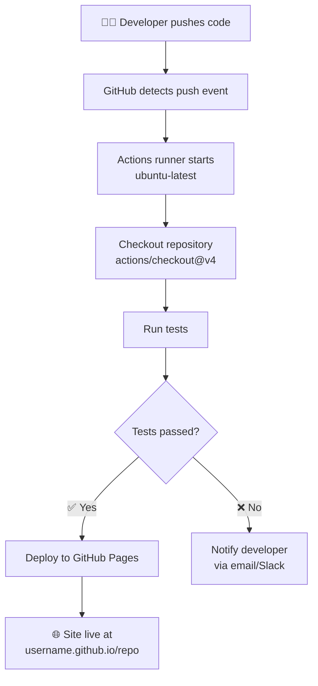

# Module 05 — GitHub Expertise: Actions, Wikis, Projects & GitHub Pages

## Learning Objectives

By the end of this module you will be able to:

1. Understand GitHub Actions for CI/CD automation.
2. Use GitHub Wikis for project documentation.
3. Manage work with GitHub Projects (kanban boards).
4. Deploy static sites via GitHub Pages.

---

## 1. Theoretical Explanation

### GitHub Actions: Event-Driven Automation

**GitHub Actions** is a CI/CD (Continuous Integration / Continuous Deployment) platform built directly into GitHub. You define automation workflows as YAML files stored in `.github/workflows/`.

**How it works:**
1. An **event** triggers the workflow (e.g., a push, a PR opened, a scheduled time)
2. GitHub spins up a **runner** — a virtual machine (Ubuntu, Windows, or macOS)
3. The runner executes **jobs** made up of **steps**
4. Each step runs commands or calls pre-built **actions** from the GitHub Marketplace

**Key concepts:**
- **Event** (`on:`) — what triggers the workflow
- **Job** — a set of steps running on one runner
- **Step** — a single command or action within a job
- **Runner** — the virtual machine environment
- **Action** — a reusable unit of work (e.g., `actions/checkout@v4`)

Example minimal workflow file (`.github/workflows/ci.yml`):
```yaml
name: CI

on: [push, pull_request]

jobs:
  build:
    runs-on: ubuntu-latest
    steps:
      - uses: actions/checkout@v4
      - name: Run tests
        run: echo "Running tests..."
```

### GitHub Wikis: Project Documentation

Every GitHub repository has a built-in **Wiki** — a documentation space separate from the code. Wikis:
- Support full Markdown
- Are themselves a Git repository (you can clone them!)
- Are ideal for Architecture Decision Records (ADRs), runbooks, and onboarding guides
- Are not tracked in your main repo (they live at `<repo>.wiki.git`)

```bash
# Clone a repo's wiki as its own Git repository
git clone https://github.com/username/repo.wiki.git
```

### GitHub Projects: Lightweight Project Management

**GitHub Projects (v2)** is a flexible project management tool that integrates natively with Issues and Pull Requests. Views include:
- **Board view** — Kanban-style columns (Todo / In Progress / Done)
- **Table view** — Spreadsheet with custom fields
- **Roadmap view** — Timeline visualization

You can link any Issue or PR to a Project and track its status automatically as it moves through your workflow.

### GitHub Pages: Free Static Site Hosting

**GitHub Pages** hosts static websites directly from a GitHub repository — for free. You can serve from:
- A specific branch (commonly `gh-pages`)
- The `main` branch
- A `/docs` folder on any branch

GitHub Pages supports **Jekyll** natively for Markdown-to-HTML conversion, making it ideal for documentation sites, portfolios, and project landing pages.

**URL format:** `https://<username>.github.io/<repo-name>`

### GitHub for Education

> [!TIP]
> GitHub Education offers free Pro accounts for verified students and teachers.
> Visit [education.github.com](https://education.github.com) to apply. Benefits include free GitHub Copilot, access to the GitHub Student Developer Pack, and free CI/CD minutes.

---

## 2. Visual Diagram

GitHub Actions trigger flow — from code push to deployment:



---

## 3. The "Cheat Code" Section

| Command / Concept | Description |
|---|---|
| `.github/workflows/ci.yml` | Location of GitHub Actions workflow definition files |
| `on: push` | Trigger the Actions workflow on every push to any branch |
| `on: pull_request` | Trigger Actions when a PR is opened, updated, or synchronized |
| `jobs: build: runs-on: ubuntu-latest` | Define a job that runs on an Ubuntu virtual machine |
| `git push --tags` | Push all local tags to remote (required for release-based Actions) |
| `gh-pages` (branch) | Conventional branch name for GitHub Pages deployment |
| `git clone <repo>.wiki.git` | Clone a repository's wiki as a standalone Git repository |
| `/docs` folder | Alternative Pages source: host from `/docs` on the main branch |
| `actions/checkout@v4` | Most common first step in any workflow — checks out your code |

---

## 4. Hands-on Lab

### Lab: "Deploy Your First GitHub Pages Site"

Let's put your Git and GitHub skills together to publish a real website.

**Step 1 — Create a `/docs` folder in your repo:**
```bash
mkdir docs
```

**Step 2 — Add an index page:**
```bash
echo "# Hello from GitHub Pages!" > docs/index.md
echo "This site is built from my Git-Mastery-Hub learning repo." >> docs/index.md
```

**Step 3 — Stage and push:**
```bash
git add docs/
git commit -m "docs: add GitHub Pages index"
git push origin main
```

**Step 4 — Enable GitHub Pages:**
- In your GitHub repo: **Settings** → **Pages** (left sidebar)
- Under **Source**: select **Deploy from a branch**
- Branch: `main`, Folder: `/docs`
- Click **Save**

**Step 5 — Visit your site:**
```
https://YOUR-USERNAME.github.io/my-first-repo
```
It may take 1–2 minutes to deploy on the first run.

**Step 6 — Create a basic GitHub Actions workflow:**
```bash
mkdir -p .github/workflows
```

Create `.github/workflows/hello.yml`:
```yaml
name: Hello World

on: [push]

jobs:
  greet:
    runs-on: ubuntu-latest
    steps:
      - name: Print greeting
        run: echo "Hello from GitHub Actions! 🚀"
```

**Step 7 — Commit and push the workflow:**
```bash
git add .github/
git commit -m "ci: add hello world GitHub Actions workflow"
git push origin main
```

**Step 8 — Watch it run:**
- In your GitHub repo, click the **Actions** tab
- You'll see your workflow running live
- Click into it to see the "Hello from GitHub Actions!" output in the logs

Congratulations! You've deployed a site and automated your first workflow. This is real DevOps in action.

> [!TIP]
> The GitHub Marketplace has thousands of pre-built Actions. Instead of writing scripts from scratch, search for actions like `actions/setup-node`, `actions/upload-artifact`, or community actions for deploying to AWS, GCP, and more.

---

**Previous:** [04-Advanced-Git ←](../04-Advanced-Git/README.md)  
**Practice Lab:** [Practice-Lab →](../Practice-Lab/README.md)  
**Cheat Sheet:** [Full Command Reference →](../CHEATSHEET.md)
