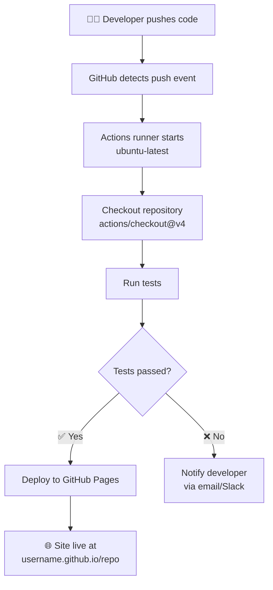

<div align="center">

<h1>Module 05 — GitHub Expertise</h1>
<h3>Actions, Wikis, Projects & GitHub Pages</h3>

[](../README.md)
[](#)
[](#4-hands-on-lab)
[](#-prerequisites)
[](../LICENSE)
[](https://education.github.com)

**[← 04 Advanced Git](../04-Advanced-Git/README.md) · [Course Home](../README.md) · [🛠️ Practice Lab →](../Practice-Lab/README.md)**

</div>

---

## 📋 Module Contents

- [Prerequisites](#-prerequisites)
- [Learning Objectives](#-learning-objectives)
- [1. Theoretical Explanation](#1-theoretical-explanation)
  - [git tag — Marking Important Points in History](#git-tag--marking-important-points-in-history)
  - [.gitignore — Telling Git What to Ignore](#gitignore--telling-git-what-to-ignore)
  - [git bisect — Finding the Commit That Broke Everything](#git-bisect--finding-the-commit-that-broke-everything)
  - [git blame — Who Wrote That Line?](#git-blame--who-wrote-that-line)
  - [GitHub Actions — CI/CD Automation](#github-actions-event-driven-automation)
  - [GitHub Wikis — Project Documentation](#github-wikis-project-documentation)
  - [GitHub Projects — Lightweight Project Management](#github-projects-lightweight-project-management)
  - [GitHub Pages — Free Static Site Hosting](#github-pages-free-static-site-hosting)
  - [GitHub for Education (Free Pro Account)](#github-for-education)
- [2. Visual Diagram — Actions Flow](#2-visual-diagram)
- [3. The "Cheat Code" Section](#3-the-cheat-code-section)
- [4. Hands-on Lab](#4-hands-on-lab)
- [5. Practice Exercises](#5-️-practice-exercises)
  - [Exercise 1 — Write Your First GitHub Actions Workflow](#exercise-1--write-your-first-github-actions-workflow)
  - [Exercise 2 — Add a Status Badge to Your README](#exercise-2--add-a-status-badge-to-your-readme)
  - [Exercise 3 — Deploy with GitHub Pages](#exercise-3--deploy-a-real-page-with-github-pages)
  - [Exercise 4 — Issues + Auto-Close via PR](#exercise-4--use-issues-to-track-work)
  - [Exercise 5 — Create a Wiki Page](#exercise-5--create-a-wiki-page)
  - [Exercise 6 — Set Up a GitHub Project Board](#exercise-6--set-up-a-github-project-board)
  - [Self-Assessment & Course Complete](#-module-05-self-assessment)

---

## ⚠️ Prerequisites

- Completion of **[Module 03 — Remote Collaboration](../03-Remote-Collaboration/README.md)**
- A **free GitHub account** — all features in this module are available on the free tier
- A GitHub repository with at least one commit pushed

> [!TIP]
> **GitHub Education** offers free Pro accounts for verified students and teachers — unlocking Copilot, advanced CI/CD minutes, and the GitHub Student Developer Pack. Apply at [education.github.com](https://education.github.com) — it's completely free.

---

## 🎯 Learning Objectives

By the end of this module you will be able to:

1. Understand GitHub Actions for CI/CD automation.
2. Use GitHub Wikis for project documentation.
3. Manage work with GitHub Projects (kanban boards).
4. Deploy static sites via GitHub Pages.

---

## 1. Theoretical Explanation

### `git tag` — Marking Important Points in History

A **tag** is a permanent label for a specific commit. Unlike a branch (which moves forward with every new commit), a tag stays frozen at one commit forever.

Tags are used to mark **releases** — `v1.0`, `v2.3.1`, `v3.0.0-beta`. When you download software and see "version 2.1.0", there is a Git tag named `v2.1.0` pointing to exactly that commit.

**Two types of tags:**

```bash
# Lightweight tag — just a pointer, no extra info
git tag v1.0

# Annotated tag — recommended for releases (has message, author, date)
git tag -a v1.0 -m "Release version 1.0 — first stable release"
```

**Common tag commands:**
```bash
git tag                         # List all tags
git tag -a v1.0 -m "message"    # Create annotated tag on current commit
git tag v1.0 3e887ab             # Tag a specific past commit
git show v1.0                    # See what commit a tag points to
git push origin v1.0             # Push ONE tag to remote
git push origin --tags           # Push ALL tags to remote
git tag -d v1.0                  # Delete a tag locally
git push origin --delete v1.0   # Delete a tag on remote
```

> [!NOTE]
> `git push` does NOT push tags automatically. You must explicitly push tags with `git push --tags` or `git push origin v1.0`. This surprises many developers the first time they release.

**Semantic Versioning (SemVer)** — how version numbers work:
```
v  MAJOR . MINOR . PATCH
v    2   .   3   .   1

MAJOR = breaking change (existing code may stop working)
MINOR = new features added, backwards compatible
PATCH = bug fix, no new features
```

---

### `.gitignore` — Telling Git What to Ignore

A `.gitignore` file tells Git to completely ignore certain files and folders. Ignored files never appear in `git status`, never get staged, and never get committed.

**Create a `.gitignore`:**
```bash
touch .gitignore       # Create it
code .gitignore        # Open in VS Code (or any editor)
```

**The pattern syntax — plain English:**

```gitignore
# Lines starting with # are comments

# Ignore a specific file by name
secrets.env
passwords.txt

# Ignore all files with a specific extension
*.log           # Any file ending in .log
*.tmp           # Any file ending in .tmp
*.pyc           # Python compiled files

# Ignore a specific folder (the trailing / means it's a folder)
node_modules/
__pycache__/
.venv/
dist/
build/

# Ignore all files inside a folder
logs/
coverage/

# Wildcard: match any single character
file?.txt       # Matches file1.txt, fileA.txt, but NOT file10.txt

# Double star: match any number of nested folders
**/temp         # Matches temp/ anywhere in the project
src/**/*.test.js  # Match all .test.js files anywhere under src/

# Negate a pattern (include something that would otherwise be ignored)
!important.log  # Do NOT ignore this specific file, even though *.log is ignored
```

**A typical `.gitignore` for a web project:**
```gitignore
# Dependencies
node_modules/

# Environment variables (NEVER commit these)
.env
.env.local
.env.production

# Build output
dist/
build/
*.min.js
*.min.css

# Editor files
.vscode/
.idea/
*.swp

# OS files
.DS_Store        # macOS
Thumbs.db        # Windows
desktop.ini      # Windows

# Logs
*.log
npm-debug.log*
```

> [!WARNING]
> `.gitignore` only works for files Git has **never tracked before**. If you already committed `secrets.env`, adding it to `.gitignore` won't help — Git still tracks it. You must run `git rm --cached secrets.env` to stop tracking it, then commit that change.

---

### `git bisect` — Finding the Commit That Broke Everything

`git bisect` is a debugging superpower. You know the code worked in the past and it's broken now. You don't know which commit broke it. `git bisect` does a **binary search** through your commit history to find the exact bad commit — automatically.

**How it works:**
1. You tell Git a "good" commit (code worked here) and a "bad" commit (code is broken here)
2. Git checks out the commit exactly halfway between them
3. You test if the code works at that point
4. You tell Git "good" or "bad"
5. Git checks out the next midpoint
6. Repeat until Git identifies the exact breaking commit

```bash
# Start bisect
git bisect start

# Tell Git the current commit is bad (broken)
git bisect bad

# Tell Git a commit from 2 weeks ago was good (working)
git bisect good v1.0
# or: git bisect good 3e887ab

# Git checks out the midpoint commit automatically
# --- TEST YOUR CODE HERE ---
# Does it work? Then:
git bisect good
# Does it NOT work? Then:
git bisect bad

# Keep testing midpoints...
# Eventually Git says:
# "abc1234 is the first bad commit"

# Stop bisect (returns you to original branch)
git bisect reset
```

**Why binary search?** If you have 1000 commits between "good" and "bad", checking each one takes 1000 tries. Binary search takes only **10 tries** (because `log₂(1000) ≈ 10`). Each answer cuts the search space in half.

---

### `git blame` — Who Wrote That Line?

`git blame` shows you, for every single line of a file, who wrote it and in which commit.

```bash
git blame README.md
```

Output:
```
3e887ab (Abhishek    2026-04-15 10:00:00 +0530  1) # GIT&GITHUB
a1b2c3d (Jane Smith  2026-04-10 09:30:00 +0530  2) 
a1b2c3d (Jane Smith  2026-04-10 09:30:00 +0530  3) Beginner to Advanced
f4e5d6c (Abhishek    2026-04-12 14:15:00 +0530  4) Your complete learning path
```

Each line shows: `SHA  (Author  Date  LineNumber) Content`

**Useful options:**
```bash
git blame -L 10,20 README.md    # Show blame for only lines 10 to 20
git blame --since=2.weeks README.md  # Only show recent changes
git log -p --follow README.md    # Full history of changes to a file (better for understanding)
```

> [!TIP]
> `git blame` is not for blame — it's for context. When you see a confusing line of code, `git blame` tells you the commit SHA. Then `git show <sha>` shows you the full commit message and context for WHY that line was written. This is one of the most valuable debugging tools you have.

---

### GitHub Actions: Event-Driven Automation

**GitHub Actions** is a CI/CD (Continuous Integration / Continuous Deployment) platform built directly into GitHub. You define automation workflows as YAML files stored in `.github/workflows/`.

**How it works:**
1. An **event** triggers the workflow (e.g., a push, a PR opened, a scheduled time)
2. GitHub spins up a **runner** — a virtual machine (Ubuntu, Windows, or macOS)
3. The runner executes **jobs** made up of **steps**
4. Each step runs commands or calls pre-built **actions** from the GitHub Marketplace

**Key concepts:**
- **Event** (`on:`) — what triggers the workflow
- **Job** — a set of steps running on one runner
- **Step** — a single command or action within a job
- **Runner** — the virtual machine environment
- **Action** — a reusable unit of work (e.g., `actions/checkout@v4`)

Example minimal workflow file (`.github/workflows/ci.yml`):
```yaml
name: CI

on: [push, pull_request]

jobs:
  build:
    runs-on: ubuntu-latest
    steps:
      - uses: actions/checkout@v4
      - name: Run tests
        run: echo "Running tests..."
```

### GitHub Wikis: Project Documentation

Every GitHub repository has a built-in **Wiki** — a documentation space separate from the code. Wikis:
- Support full Markdown
- Are themselves a Git repository (you can clone them!)
- Are ideal for Architecture Decision Records (ADRs), runbooks, and onboarding guides
- Are not tracked in your main repo (they live at `<repo>.wiki.git`)

```bash
# Clone a repo's wiki as its own Git repository
git clone https://github.com/username/repo.wiki.git
```

### GitHub Projects: Lightweight Project Management

**GitHub Projects (v2)** is a flexible project management tool that integrates natively with Issues and Pull Requests. Views include:
- **Board view** — Kanban-style columns (Todo / In Progress / Done)
- **Table view** — Spreadsheet with custom fields
- **Roadmap view** — Timeline visualization

You can link any Issue or PR to a Project and track its status automatically as it moves through your workflow.

### GitHub Pages: Free Static Site Hosting

**GitHub Pages** hosts static websites directly from a GitHub repository — for free. You can serve from:
- A specific branch (commonly `gh-pages`)
- The `main` branch
- A `/docs` folder on any branch

GitHub Pages supports **Jekyll** natively for Markdown-to-HTML conversion, making it ideal for documentation sites, portfolios, and project landing pages.

**URL format:** `https://<username>.github.io/<repo-name>`

### GitHub for Education

> [!TIP]
> GitHub Education offers free Pro accounts for verified students and teachers.
> Visit [education.github.com](https://education.github.com) to apply. Benefits include free GitHub Copilot, access to the GitHub Student Developer Pack, and free CI/CD minutes.

---

## 2. Visual Diagram

GitHub Actions trigger flow — from code push to deployment:



---

## 3. The "Cheat Code" Section

| Command / Concept | Description |
|---|---|
| `.github/workflows/ci.yml` | Location of GitHub Actions workflow definition files |
| `on: push` | Trigger the Actions workflow on every push to any branch |
| `on: pull_request` | Trigger Actions when a PR is opened, updated, or synchronized |
| `jobs: build: runs-on: ubuntu-latest` | Define a job that runs on an Ubuntu virtual machine |
| `git push --tags` | Push all local tags to remote (required for release-based Actions) |
| `gh-pages` (branch) | Conventional branch name for GitHub Pages deployment |
| `git clone <repo>.wiki.git` | Clone a repository's wiki as a standalone Git repository |
| `/docs` folder | Alternative Pages source: host from `/docs` on the main branch |
| `actions/checkout@v4` | Most common first step in any workflow — checks out your code |

---

## 4. Hands-on Lab

### Lab: "Deploy Your First GitHub Pages Site"

Let's put your Git and GitHub skills together to publish a real website.

**Step 1 — Create a `/docs` folder in your repo:**
```bash
mkdir docs
```

**Step 2 — Add an index page:**
```bash
echo "# Hello from GitHub Pages!" > docs/index.md
echo "This site is built from my GIT&GITHUB learning repo." >> docs/index.md
```

**Step 3 — Stage and push:**
```bash
git add docs/
git commit -m "docs: add GitHub Pages index"
git push origin main
```

**Step 4 — Enable GitHub Pages:**
- In your GitHub repo: **Settings** → **Pages** (left sidebar)
- Under **Source**: select **Deploy from a branch**
- Branch: `main`, Folder: `/docs`
- Click **Save**

**Step 5 — Visit your site:**
```
https://abhishek01dev.github.io/my-first-repo
```
It may take 1–2 minutes to deploy on the first run.

**Step 6 — Create a basic GitHub Actions workflow:**
```bash
mkdir -p .github/workflows
```

Create `.github/workflows/hello.yml`:
```yaml
name: Hello World

on: [push]

jobs:
  greet:
    runs-on: ubuntu-latest
    steps:
      - name: Print greeting
        run: echo "Hello from GitHub Actions! 🚀"
```

**Step 7 — Commit and push the workflow:**
```bash
git add .github/
git commit -m "ci: add hello world GitHub Actions workflow"
git push origin main
```

**Step 8 — Watch it run:**
- In your GitHub repo, click the **Actions** tab
- You'll see your workflow running live
- Click into it to see the "Hello from GitHub Actions!" output in the logs

Congratulations! You've deployed a site and automated your first workflow. This is real DevOps in action.

> [!TIP]
> The GitHub Marketplace has thousands of pre-built Actions. Instead of writing scripts from scratch, search for actions like `actions/setup-node`, `actions/upload-artifact`, or community actions for deploying to AWS, GCP, and more.

---

## 5. 🏋️ Practice Exercises

> These exercises connect your Git skills to the GitHub platform. Each one is something a real developer does in their first week at a new job.

---

### Exercise 1 — Write Your First GitHub Actions Workflow
Automate a simple task that runs every time you push code.

**Task:** Create a workflow that prints your name on every push.

```bash
# In your repo:
mkdir -p .github/workflows
```

Create `.github/workflows/greet.yml`:
```yaml
name: Hello, Developer!

on:
  push:
    branches: [ main ]
  pull_request:
    branches: [ main ]

jobs:
  greet:
    runs-on: ubuntu-latest

    steps:
      - name: Checkout code
        uses: actions/checkout@v4

      - name: Greet the developer
        run: |
          echo "=============================="
          echo "Hello! Push received on main."
          echo "Triggered by: ${{ github.actor }}"
          echo "Commit SHA: ${{ github.sha }}"
          echo "=============================="

      - name: Show repository contents
        run: ls -la
```

Commit and push:
```bash
git add .github/
git commit -m "ci: add greeting workflow"
git push origin main
```

- [ ] **Done** when the **Actions** tab on GitHub shows a green checkmark for this workflow
- [ ] Click into the run and find your name in the output (`github.actor`)

---

### Exercise 2 — Add a Status Badge to Your README
Display your workflow's live status directly in your README.

**Task:** Add a badge that shows whether your CI is passing or failing.

1. On GitHub, go to **Actions** → click your workflow → click the `...` menu → **Create status badge**
2. Copy the generated Markdown
3. Paste it at the top of your `README.md` in the badges section

It looks like:
```markdown
[](https://github.com/abhishek01dev/Git-Github/actions/workflows/greet.yml)
```

```bash
git add README.md
git commit -m "docs: add CI status badge to README"
git push origin main
```

- [ ] **Done** when your README on GitHub shows a live green "passing" badge

---

### Exercise 3 — Deploy a Real Page with GitHub Pages
Turn your markdown files into a live website anyone can visit.

**Task:**

```bash
# Create the docs folder
mkdir docs

# Add an index page
cat > docs/index.md << 'EOF'
# My Git Learning Journey

I'm learning Git and GitHub through the GIT&GITHUB course.

## Progress
- [x] Module 00 — Introduction
- [x] Module 01 — Foundations
- [x] Module 02 — Intermediate Workflows
- [x] Module 03 — Remote Collaboration
- [x] Module 04 — Advanced Git
- [x] Module 05 — GitHub Expertise

## What I've learned
Git is a distributed version control system. Every commit is immutable.
EOF

git add docs/
git commit -m "docs: add GitHub Pages index with learning progress"
git push origin main
```

On GitHub:
1. **Settings** → **Pages**
2. Source: **Deploy from a branch**
3. Branch: `main`, Folder: `/docs`
4. Click **Save**

Wait 2 minutes, then visit:
```
https://abhishek01dev.github.io/Git-Github
```

- [ ] **Done** when you can access your live page in a browser
- [ ] Share the URL — it's publicly accessible without login

---

### Exercise 4 — Use Issues to Track Work
Open an Issue, reference it in a commit, and automatically close it via a PR.

**Task:**

**Step 1 — Create an Issue on GitHub:**
1. Go to **Issues** → **New Issue**
2. Title: `Add a FAQ section to README`
3. Description: `The README needs a FAQ section explaining common Git questions.`
4. Submit the Issue — note its number (e.g., `#7`)

**Step 2 — Create a branch and fix the issue:**
```bash
git switch -c fix/issue-7-faq
cat >> README.md << 'EOF'

## FAQ

**Q: Do I need to commit every file?**
A: No. The staging area lets you choose exactly which changes to commit.

**Q: Can I undo a commit?**
A: Yes. Use `git reset HEAD^` to undo the last commit while keeping changes.
EOF

git add README.md
git commit -m "docs: add FAQ section — closes #7"
# ↑ "closes #7" will auto-close the Issue when this PR is merged
git push -u origin fix/issue-7-faq
```

**Step 3 — Open a PR:**
- On GitHub, create a PR from `fix/issue-7-faq` to `main`
- In the PR description, write: `Closes #7`

**Step 4 — Merge the PR.**

- [ ] **Done** when Issue `#7` automatically shows as **Closed** after the PR is merged
- [ ] Notice: GitHub links the Issue and PR together in the timeline

> [!TIP]
> Keywords that auto-close issues when a PR merges: `closes`, `fixes`, `resolves` followed by `#<issue-number>`. Works in the commit message OR the PR description.

---

### Exercise 5 — Create a Wiki Page
Add documentation to your repo's Wiki that's separate from your code.

**Task:**

1. On GitHub, click **Wiki** tab → **Create the first page**
2. Title: `Architecture Notes`
3. Content:
```markdown
# Architecture Notes

## Repository Structure
This repo uses a module-based structure where each folder contains
a complete learning unit with theory, diagrams, commands, and a lab.

## Naming Conventions
- Module folders: `00-ModuleName/`
- Practice logs: `YYYY-MM-DD_Day-N_log.md`
- Feature branches: `feature/description`
- Fix branches: `fix/description`

## Commit Message Prefixes
| Prefix | Meaning |
|---|---|
| `feat:` | New feature or content |
| `fix:` | Bug fix or correction |
| `docs:` | Documentation update |
| `ci:` | GitHub Actions change |
| `log:` | Practice log entry |
```
4. Click **Save Page**

Now clone the wiki as its own Git repo:
```bash
git clone https://github.com/abhishek01dev/Git-Github.wiki.git
ls Git-Github.wiki/   # You'll see your wiki page as a .md file
```

- [ ] **Done** when the wiki page is visible on GitHub
- [ ] **Done** when you've successfully cloned the wiki locally

---

### Exercise 6 — Set Up a GitHub Project Board
Create a Kanban board to track your remaining learning tasks.

**Task:**

1. On GitHub, click **Projects** → **New project**
2. Choose **Board** template
3. Name it: `GIT&GITHUB Learning Progress`
4. Add columns: `To Do` / `In Progress` / `Done`

Add these cards to **To Do**:
- `Complete Module 00 exercises`
- `Complete Module 01 exercises`
- `Complete Module 02 exercises`
- `Complete Module 03 exercises`
- `Complete Module 04 exercises`
- `Complete Module 05 exercises`
- `Start 30-day practice log`

Move the Module 05 card to **Done** right now (you're doing it!).

- [ ] **Done** when the board exists with at least 7 cards
- [ ] Link the Project to your repository: Project settings → **Linked repositories** → add your repo

---

### 🎯 Module 05 Self-Assessment

| Challenge | Confident? |
|---|:---:|
| Create a GitHub Actions workflow from scratch | ☐ Yes ☐ Need practice |
| Add a live status badge to a README | ☐ Yes ☐ Need practice |
| Enable and deploy GitHub Pages from `/docs` | ☐ Yes ☐ Need practice |
| Open an Issue and auto-close it via a PR | ☐ Yes ☐ Need practice |
| Create and clone a Wiki repo | ☐ Yes ☐ Need practice |
| Set up a GitHub Project board | ☐ Yes ☐ Need practice |
| Explain the difference between Git and GitHub | ☐ Yes ☐ Need practice |

---

### 🏆 Course Complete!

You've finished all 6 modules. Here's what you can now do:

- ✅ Install, configure, and use Git from scratch
- ✅ Stage selectively, commit atomically, read history
- ✅ Branch, merge, and resolve conflicts
- ✅ Work with remote repositories and Pull Requests
- ✅ Rebase, cherry-pick, and recover from mistakes
- ✅ Automate workflows and publish with GitHub

**Your next step:** Head to the [Practice Lab](../Practice-Lab/README.md) and start your 30-day daily practice log. The skills become permanent through repetition — not through reading.

---

<div align="center">

| ← Previous | Home | Next → |
|:---:|:---:|:---:|
| [04 — Advanced Git](../04-Advanced-Git/README.md) | [📖 Course Home](../README.md) | [🛠️ Practice Lab](../Practice-Lab/README.md) |

**[📋 Full Cheat Sheet](../CHEATSHEET.md) · [🛠️ Practice Lab](../Practice-Lab/README.md) · [📄 License](../LICENSE)**

*You've completed all 6 modules! Time to put it into practice — head to the [Practice Lab](../Practice-Lab/README.md).*

*Part of the free, open-source [GIT&GITHUB](../README.md) curriculum — MIT Licensed.*

</div>
