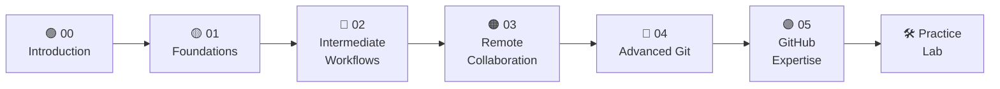

<div align="center">

<h1>🚀 GIT&GITHUB</h1>
<h3>Beginner to Advanced — The Complete, Free, Open-Source Git Learning Path</h3>

<p><em>From your first <code>git init</code> to advanced history rewriting — structured modules, visual diagrams, hands-on labs, and a 30-day practice system.</em></p>

<br/>

[](LICENSE)
[](CONTRIBUTING.md)
[](#-table-of-contents)
[](CHEATSHEET.md)
[](#-license)
[](#-license)
[](https://github.com/abhishek01dev/Git-Github)
[](https://github.com/abhishek01dev/Git-Github/fork)

<br/>

[**🚀 Start Learning**](#-quick-start) · [**📋 Cheat Sheet**](CHEATSHEET.md) · [**🛠️ Practice Lab**](Practice-Lab/README.md) · [**🤝 Contribute**](CONTRIBUTING.md) · [**📖 All Modules**](#-table-of-contents)

</div>

---

## 📋 Table of Contents

- [About This Project](#-about-this-project)
- [Why GIT&GITHUB?](#-why-gitgithub)
- [What You Will Learn](#-what-you-will-learn)
- [Course Roadmap](#-course-roadmap)
- [Repository Structure](#-repository-structure)
- [Table of Contents — Modules](#-table-of-contents--modules)
- [Quick Start](#-quick-start)
- [How to Fork & Use This Repository](#-how-to-fork--use-this-repository)
- [Who Is This For?](#-who-is-this-for)
- [The 30-Day Practice System](#-the-30-day-practice-system)
- [Command Coverage](#-command-coverage)
- [Prerequisites](#-prerequisites)
- [Contributing](#-contributing)
- [Code of Conduct](#-code-of-conduct)
- [License](#-license)
- [Acknowledgements](#-acknowledgements)
- [Interview Questions](#-interview-questions-per-module)

---

## 🧭 About This Project

**GIT&GITHUB** is a free, open-source, self-contained Git and GitHub learning repository. It is structured as a 6-module course with hands-on terminal labs, Mermaid visual diagrams, a comprehensive 77-command cheat sheet, and a 30-day practice tracking system.

Everything here is written in plain Markdown — no login required, no paid tools, no subscriptions. Clone it, fork it, star it, contribute to it. It's yours.

> **This repository is 100% free and always will be.** Licensed under the MIT License — use it personally, in your classroom, at your company, or as the foundation for your own course.

---

## 🌟 Why GIT&GITHUB?

Most Git resources are either too shallow (a 5-minute overview) or too dense (the full `git --help` man page). GIT&GITHUB hits the sweet spot:

| Feature | GIT&GITHUB | Random Blog Post | Official Docs |
|---|:---:|:---:|:---:|
| Structured learning path | ✅ | ❌ | ❌ |
| Visual diagrams for every concept | ✅ | Sometimes | ❌ |
| Hands-on terminal labs | ✅ | Sometimes | ❌ |
| 30-day practice system | ✅ | ❌ | ❌ |
| Complete 77-command cheat sheet | ✅ | ❌ | ✅ |
| Beginner to advanced in one place | ✅ | ❌ | ✅ |
| 100% free & open-source | ✅ | ✅ | ✅ |
| Forkable for personal progress tracking | ✅ | ❌ | ❌ |

---

## 🎯 What You Will Learn

After completing this course you will be able to:

**Foundations**
- ✅ Explain the difference between Git and GitHub
- ✅ Install and configure Git on Windows, macOS, and Linux
- ✅ Understand Git's three states: **Working Directory → Staging Area → Repository**
- ✅ Use `git add`, `git commit`, `git status`, `git diff` — and know exactly what each does internally
- ✅ Read `git diff` output (understand `+`, `-`, `@@` lines)
- ✅ Read `git log` output and use 8+ useful log variants
- ✅ Remove and rename files properly with `git rm` and `git mv`

**Branching & Merging**
- ✅ Create, switch, merge, and delete branches with confidence
- ✅ Explain HEAD, detached HEAD state, and how to recover
- ✅ Know when `git switch` vs `git checkout` is appropriate (and why two commands exist)
- ✅ Explain the difference between fast-forward, 3-way, and squash merges
- ✅ Resolve merge conflicts from start to finish
- ✅ Use `git stash` to save work-in-progress and manage a stash stack

**Remote Collaboration**
- ✅ Connect local repos to GitHub using HTTPS or SSH
- ✅ Explain what `git push` actually does step-by-step
- ✅ Know the difference between `git fetch` and `git pull` (with real analogies)
- ✅ Set up and manage multiple remotes (`origin`, `upstream`, fork workflow)
- ✅ Create, review, and merge Pull Requests
- ✅ Recover from a rejected push without using `--force`

**Advanced Git**
- ✅ Rebase branches for a clean linear history
- ✅ Use interactive rebase (`git rebase -i`) to squash, reorder, and drop commits
- ✅ Cherry-pick individual commits across branches
- ✅ Recover from any mistake using `git reflog`
- ✅ Understand all three modes of `git reset` (--soft, --mixed, --hard)
- ✅ Know when to use `git restore` vs `git reset` vs `git revert`
- ✅ Delete untracked files safely with `git clean`

**GitHub & Advanced Tools**
- ✅ Create and manage Git tags for releases (with semantic versioning)
- ✅ Write `.gitignore` files with full pattern syntax (`*`, `**`, `!`, nested folders)
- ✅ Use `git bisect` to find exactly which commit broke your code
- ✅ Use `git blame` to understand who wrote any line and why
- ✅ Write GitHub Actions workflows for CI/CD automation
- ✅ Deploy static sites with GitHub Pages
- ✅ Use GitHub Wikis and Projects for documentation and planning

---

## 📍 Course Roadmap



Each module builds directly on the previous one. Beginners: start at `00`. Experienced developers: jump to the module that matches your current skill level.

---

## 📁 Repository Structure

```
GIT&GITHUB/
│
├── README.md                          ← You are here — project landing page
├── CHEATSHEET.md                      ← 77 commands, 14 categories, all in one file
├── PRACTICE_TEMPLATE.md               ← 30-day daily log template
├── CONTRIBUTING.md                    ← How to contribute to this project
├── LICENSE                            ← MIT License — free to use
├── .gitignore                         ← Standard development .gitignore
│
├── 00-Introduction/
│   └── README.md                      ← Why Git? Git vs GitHub, 3 states, install, config, what is a repo
│
├── 01-Foundations/
│   └── README.md                      ← init, add (5 forms), commit, status, log (8 variants), diff, rm, mv
│
├── 02-Intermediate-Workflows/
│   └── README.md                      ← Branches, HEAD, detached HEAD, switch vs checkout, merge types, stash
│
├── 03-Remote-Collaboration/
│   └── README.md                      ← Remotes, push (mechanics), fetch vs pull, HTTPS/SSH, fork workflow, PRs
│
├── 04-Advanced-Git/
│   └── README.md                      ← Rebase, cherry-pick, reflog, reset (3 modes), restore, clean
│
├── 05-GitHub-Expertise/
│   └── README.md                      ← Tags, .gitignore, bisect, blame, Actions, Wikis, Projects, Pages
│
└── Practice-Lab/
    ├── README.md                      ← Instructions for forked users
    └── .gitkeep                       ← Keeps folder tracked when empty
```

---

## 📚 Table of Contents — Modules

| Module | Title | Key Commands & Concepts | Diagram Type |
|:---:|---|---|:---:|
| [00](00-Introduction/README.md) | **Introduction — Why Git? Setup & Configuration** | `git config`, `git --version`, VCS history, 3 states, Git vs GitHub, what is a repository | `graph TD` |
| [01](01-Foundations/README.md) | **Foundations — Init, Add, Commit, Status, Log** | `git init`, `git add` (5 forms), `git commit`, `git status`, `git log` (8 variants), `git diff`, `git rm`, `git mv` | `sequenceDiagram` |
| [02](02-Intermediate-Workflows/README.md) | **Intermediate Workflows — Branching, Merging & Stashing** | `git branch`, `git switch` vs `git checkout`, `git merge`, `git stash`, HEAD & detached HEAD, fast-forward vs 3-way | `gitGraph` ×3 |
| [03](03-Remote-Collaboration/README.md) | **Remote Collaboration — Remotes, Push, Pull & Pull Requests** | `git remote`, `git push` (5-step mechanics), `git pull` vs `git fetch`, HTTPS vs SSH auth, fork workflow, PRs | `sequenceDiagram` |
| [04](04-Advanced-Git/README.md) | **Advanced Git — Rebase, Cherry-pick, Reflog & History Rewriting** | `git rebase -i`, `git cherry-pick`, `git reflog`, `git reset` (--soft/--mixed/--hard), `git restore`, `git clean` | `gitGraph` ×2 |
| [05](05-GitHub-Expertise/README.md) | **GitHub Expertise — Actions, Wikis, Projects & Pages** | `git tag`, `.gitignore` patterns, `git bisect`, `git blame`, GitHub Actions YAML, Pages, Wikis, Projects | `flowchart TD` |
| [Lab](Practice-Lab/README.md) | **Practice Lab — 30-Day Git Dojo** | Daily commit logs, fork workflow, stuck-recovery guide, 30-day pacing calendar | — |
| [📋](CHEATSHEET.md) | **Complete Cheat Sheet** | All 77 commands in 14 categories with source attribution | — |
| [❓](00-Introduction/INTERVIEW_QUESTIONS.md) | **Module 00 Interview Questions** | Git vs GitHub, VCS types, config, 3 states — 25 Q&A | — |
| [❓](01-Foundations/INTERVIEW_QUESTIONS.md) | **Module 01 Interview Questions** | add, commit, diff, log, rm, mv — 30 Q&A | — |
| [❓](02-Intermediate-Workflows/INTERVIEW_QUESTIONS.md) | **Module 02 Interview Questions** | Branching, HEAD, merge types, stash, conflicts — 30 Q&A | — |
| [❓](03-Remote-Collaboration/INTERVIEW_QUESTIONS.md) | **Module 03 Interview Questions** | Remotes, push, fetch vs pull, SSH, PRs — 32 Q&A | — |
| [❓](04-Advanced-Git/INTERVIEW_QUESTIONS.md) | **Module 04 Interview Questions** | Reset (3 modes), rebase, reflog, cherry-pick, clean — 32 Q&A | — |
| [❓](05-GitHub-Expertise/INTERVIEW_QUESTIONS.md) | **Module 05 Interview Questions** | Tags, .gitignore, bisect, blame, Actions, CI/CD — 30 Q&A | — |

---

## 🚀 Quick Start

### Option A — Learn (Clone)

```bash
# Clone the repository
git clone https://github.com/abhishek01dev/Git-Github.git

# Navigate into it
cd Git-Github

# Start at the beginning
# Open 00-Introduction/README.md in your editor or browser
```

### Option B — Practice (Fork)

1. Click **Fork** at the top-right of this GitHub page.
2. Clone your fork:
   ```bash
   git clone https://github.com/abhishek01dev/Git-Github.git
   cd Git-Github
   ```
3. Copy and rename the practice template:
   ```bash
   cp PRACTICE_TEMPLATE.md Practice-Lab/$(date +%Y-%m-%d)_Day-1_log.md
   ```
4. Fill in the log, commit, and push every day:
   ```bash
   git add Practice-Lab/
   git commit -m "log: Day 1 — Module 00 Introduction"
   git push origin main
   ```

### Option C — Just Use the Cheat Sheet

Go straight to **[CHEATSHEET.md](CHEATSHEET.md)** — it has all 77 commands organized into 14 categories with descriptions and source attribution. Bookmark it. Print it. Tattoo it (optional).

---

## 🍴 How to Fork & Use This Repository

Forking creates your own personal copy of this repository on GitHub — separate from the original. You can commit your daily practice logs, notes, and exercises without affecting anyone else. Your changes are yours.

**Clone** = read-only copy on your machine. **Fork** = your own copy on GitHub that you own and can push to.

### Step 1 — Fork on GitHub

1. Go to [github.com/abhishek01dev/Git-Github](https://github.com/abhishek01dev/Git-Github)
2. Click the **Fork** button (top-right corner)
3. Select your account — GitHub creates `YOUR-USERNAME/Git-Github` in seconds

### Step 2 — Clone Your Fork

```bash
# Replace YOUR-USERNAME with your actual GitHub username
git clone https://github.com/YOUR-USERNAME/Git-Github.git
cd Git-Github
```

### Step 3 — Set the Original as `upstream`

This lets you pull in future updates from the original repo while keeping your own changes.

```bash
git remote add upstream https://github.com/abhishek01dev/Git-Github.git

# Verify both remotes exist
git remote -v
# origin    https://github.com/YOUR-USERNAME/Git-Github.git (fetch)
# origin    https://github.com/YOUR-USERNAME/Git-Github.git (push)
# upstream  https://github.com/abhishek01dev/Git-Github.git (fetch)
# upstream  https://github.com/abhishek01dev/Git-Github.git (push)
```

### Step 4 — Keep Your Fork Synced

When new modules, diagrams, or exercises are added to the original:

```bash
git fetch upstream          # download updates from original
git merge upstream/main     # apply them to your local main
git push origin main        # push the merged result to your fork
```

### Step 5 — Start Your Daily Practice Log

```bash
# Copy the template with today's date
cp PRACTICE_TEMPLATE.md Practice-Lab/$(date +%Y-%m-%d)_Day-1_log.md

# Fill it in, then commit and push
git add Practice-Lab/
git commit -m "log: Day 1 — Module 00 Introduction"
git push origin main
```

Every push adds a green square to your GitHub contribution graph. After 30 days, you'll have a visible streak and a complete learning record.

> [!TIP]
> Share your fork link in the [Discussions](https://github.com/abhishek01dev/Git-Github/discussions) tab — it's motivating to see others' progress, and others will find yours motivating too.

---

## 👥 Who Is This For?

<table>
<tr>
<th>🎓 The Learner</th>
<th>🛠️ The Practitioner</th>
<th>👨‍🏫 The Educator</th>
</tr>
<tr>
<td>Junior developer, CS student, or career switcher with little to no Git experience</td>
<td>Developer building a 30-day Git habit and documenting their progress</td>
<td>Instructor looking for a structured, free, forkable Git curriculum</td>
</tr>
<tr>
<td>Reads modules in order, runs terminal labs, follows the diagrams</td>
<td>Forks the repo, commits daily logs, tracks progress over 30 days</td>
<td>Assigns modules as homework, uses labs as classroom exercises</td>
</tr>
<tr>
<td><strong>Clone</strong> and read sequentially</td>
<td><strong>Fork</strong> and commit daily</td>
<td><strong>Fork or template</strong> for your class</td>
</tr>
</table>

---

## 📅 The 30-Day Practice System

The [`PRACTICE_TEMPLATE.md`](PRACTICE_TEMPLATE.md) is a structured daily log. Each day you record:

- 📚 Which module you studied
- ⚡ Commands you practiced (with notes)
- 🔬 Lab exercises completed
- 💡 Key takeaways (max 3 bullet points)
- ❓ Questions or blockers
- ⭐ Confidence rating (1–5)

**Days 1–5** are pre-filled as examples. **Days 6–30** are blank templates.

```
Practice-Lab/
├── 2026-04-15_Day-1_log.md    ← Your first log
├── 2026-04-16_Day-2_log.md    ← Consistency builds mastery
├── ...
└── 2026-05-14_Day-30_log.md   ← 🏆 You did it
```

Each `git push` of a daily log adds a green square to your GitHub contribution graph — visible proof of your learning streak.

---

## ⌨️ Command Coverage

This repository documents **77 Git commands** across **14 categories**:

| Category | Commands Covered |
|---|---|
| Setup & Configuration | `git config`, `man git-config`, aliases |
| Initialize & Clone | `git init`, `git clone` |
| Stage & Snapshot | `git add`, `git add -p`, `git reset`, `git rm`, `git mv`, `git status` |
| Committing | `git commit`, `--amend`, `-am` |
| Branching | `git branch`, `git switch`, `git checkout` (both modern and legacy) |
| Merging & Rebasing | `git merge`, `--squash`, `git rebase`, `git rebase -i`, `git cherry-pick` |
| Remote Operations | `git remote`, `git push`, `git pull`, `git fetch`, `--force-with-lease` |
| Diff & Inspect | `git diff`, `git show`, multi-commit diff forms |
| Tracking Path Changes | `git rm`, `git mv`, `--stat -M` |
| Stashing | `git stash`, `list`, `pop`, `drop` |
| Undoing & History Rewriting | `git reset`, `git restore`, `git reflog`, `git clean` |
| Ignoring Files | `.gitignore`, `core.excludesfile`, `rm --cached` |
| Code Archaeology | `git log`, `git blame`, `git log -G`, `--follow`, `--graph` |
| Commit References | branch, tag, SHA, `HEAD`, `HEAD~N`, `origin/main` |

➡️ **[View the full Cheat Sheet →](CHEATSHEET.md)**

---

## 🔧 Prerequisites

| Requirement | Notes |
|---|---|
| **Git** (v2.23+) | [Download git-scm.com](https://git-scm.com/downloads) — v2.23+ required for `git switch` |
| **A terminal** | Terminal, iTerm2, Git Bash, WSL, or PowerShell |
| **A text editor** | VS Code, Vim, Nano — any editor works |
| **A GitHub account** | Free at [github.com](https://github.com) — required for Modules 03 and 05 |
| **No prior Git knowledge** | Modules 00–01 assume zero experience |

**Verify your Git version:**
```bash
git --version
# git version 2.43.0  ← 2.23+ is all you need
```

---

## 🤝 Contributing

Contributions make this project better for everyone. All skill levels welcome.

**Ways to contribute:**
- 🐛 **Fix a bug** — typo, broken link, incorrect command
- ✍️ **Improve an explanation** — clearer wording, better example
- 🔬 **Add a lab exercise** — new hands-on step to an existing module
- 📊 **Add a diagram** — additional Mermaid visualization
- 🌍 **Translate** — help make this accessible in other languages

**Process:**
1. Fork the repository
2. Create a feature branch: `git switch -c fix/typo-in-module-01`
3. Make your changes following the [style guide](#style-guide)
4. Commit with a descriptive message: `git commit -m "fix: correct git reset description in Module 01"`
5. Push and open a Pull Request with a clear description

**Style Guide:**
- All command sections must be titled **"The 'Cheat Code' Section"** (exact wording)
- Use GitHub-flavored callouts: `> [!NOTE]`, `> [!TIP]`, `> [!WARNING]`
- Every module README must have exactly 5 sections: Theory → Diagram → Cheat Code → Lab → Practice Exercises
- Always mention `git switch` as the modern alternative when documenting `git checkout`
- Always mention `--force-with-lease` when documenting `--force`
- All Mermaid diagrams must use ` ```mermaid ` code blocks

See **[CONTRIBUTING.md](CONTRIBUTING.md)** for the full guide.

---

## 📜 Code of Conduct

This project follows a standard open-source Code of Conduct. Be kind, be helpful, be constructive. Harassment of any kind will not be tolerated.

If you witness or experience unacceptable behavior, please open an Issue or contact the maintainers directly.

---

## 📄 License

This project is licensed under the **MIT License** — one of the most permissive open-source licenses in existence.

```
MIT License

Copyright (c) 2026 GIT&GITHUB Contributors

Permission is hereby granted, free of charge, to any person obtaining a copy
of this software and associated documentation files (the "Software"), to deal
in the Software without restriction, including without limitation the rights
to use, copy, modify, merge, publish, distribute, sublicense, and/or sell
copies of the Software, and to permit persons to whom the Software is
furnished to do so, subject to the following conditions:

The above copyright notice and this permission notice shall be included in all
copies or substantial portions of the Software.
```

**What the MIT License means for you:**

| You CAN | You CANNOT |
|---|---|
| ✅ Use this project for free, forever | ❌ Hold contributors liable |
| ✅ Use it in personal projects | ❌ Remove the copyright notice |
| ✅ Use it in commercial projects | |
| ✅ Modify the content | |
| ✅ Distribute copies | |
| ✅ Fork and create your own version | |
| ✅ Use it in your classroom or company | |
| ✅ Publish derivative works | |

➡️ **[See full LICENSE →](LICENSE)**

---

## ❓ Interview Questions Per Module

Each module includes a dedicated `INTERVIEW_QUESTIONS.md` with real interview questions covering the module's content — from conceptual basics to tricky scenarios.

| Module | File | Questions | Level |
|:---:|---|:---:|---|
| 00 | [Introduction — Q&A](00-Introduction/INTERVIEW_QUESTIONS.md) | 25 | Beginner |
| 01 | [Foundations — Q&A](01-Foundations/INTERVIEW_QUESTIONS.md) | 30 | Beginner–Intermediate |
| 02 | [Intermediate Workflows — Q&A](02-Intermediate-Workflows/INTERVIEW_QUESTIONS.md) | 30 | Intermediate |
| 03 | [Remote Collaboration — Q&A](03-Remote-Collaboration/INTERVIEW_QUESTIONS.md) | 32 | Intermediate |
| 04 | [Advanced Git — Q&A](04-Advanced-Git/INTERVIEW_QUESTIONS.md) | 32 | Advanced |
| 05 | [GitHub Expertise — Q&A](05-GitHub-Expertise/INTERVIEW_QUESTIONS.md) | 30 | Advanced |

**Total: 179 Q&A pairs** — conceptual questions, applied scenarios, output-reading exercises, and quick-fire rounds.

---

## 🙏 Acknowledgements

This project is built on the shoulders of excellent existing resources:

- **[GitHub Education Cheat Sheet](https://education.github.com/git-cheat-sheet-education.pdf)** — the foundational command reference that informed Section 6.1 of this curriculum
- **[git --print-out Cheat Sheet](https://git-scm.com)** — the practical command reference that informed Section 6.2
- **[Pro Git Book](https://git-scm.com/book/en/v2)** by Scott Chacon and Ben Straub — the definitive free Git reference (CC BY-NC-SA 3.0)
- **[Linus Torvalds](https://github.com/torvalds)** — for creating Git in 2005 so we'd never lose a line of code again
- **[GitHub](https://github.com)** — for making Git social and accessible to millions of developers

---

## 🌐 Community & Support

| Channel | Purpose |
|---|---|
| [Open an Issue](https://github.com/abhishek01dev/Git-Github/issues) | Bug reports, content errors, feature requests |
| [Start a Discussion](https://github.com/abhishek01dev/Git-Github/discussions) | Questions, show your 30-day progress, tips |
| [Pull Requests](https://github.com/abhishek01dev/Git-Github/pulls) | Contribute improvements |

---

## 📊 Project Stats

```
📦  20 files          🗂️  7 directories       📝  6 module READMEs
⌨️  77 commands       📋  14 cheat sheet categories    ❓  179 interview Q&A
📅  30-day tracker    🔬  6 practice exercise sets      📊  10 Mermaid diagrams
```

---

<div align="center">

**If this repository helped you, please consider giving it a ⭐ — it helps others find it.**

[](https://github.com/abhishek01dev/Git-Github)

<br/>

*Built with care for developers at every level.*  
*Start at Module 00 and take it one commit at a time.*

**[🚀 Start Learning Now →](00-Introduction/README.md)**

</div>
